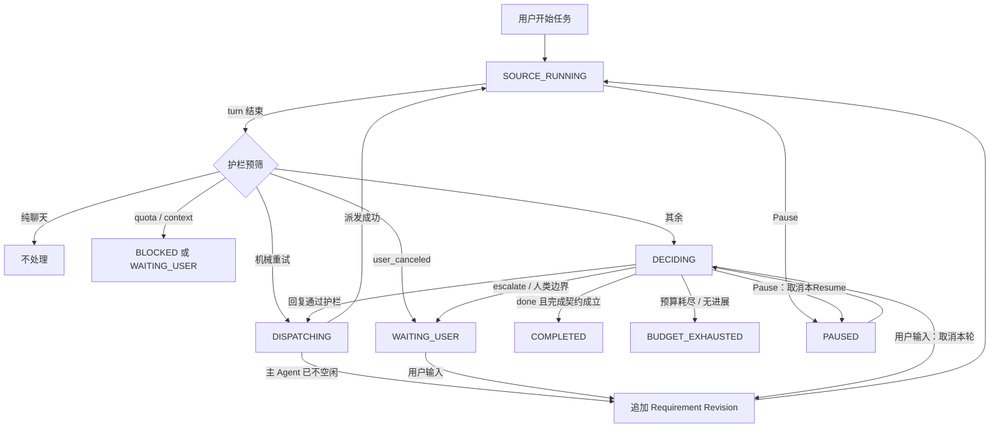

# 主 Agent 外部持续监督器设计（decider 模式）

状态：设计与实现记录。当前仅支持 v3，PASS 捷径已实现、v2 已移除；尚未实现的协议见 §19.1。现有实现见 [design.md](design.md) 与 [turn-outcomes.md](turn-outcomes.md)。

本插件的本质是**自动回答**：主 Agent 每结束一轮，由一个独立的 decider Agent 判断下一步该做什么。它可以一次安排多件事（由插件并行派出 verifier、reviewer 等子 Agent），汇总结果后给主 Agent 一条回复。插件持续这样驱动任务，直到完成契约成立；只有遇到关键决策、越过安全边界或预算耗尽时，才请人介入。

它不替代 Codex `/goal`，也不要求用户输入新命令。

## 1. 原则

1. **自动优先，人只在关键决策介入。** 凡是能从需求、仓库和证据中确定的事，都由 decider 处理；只有 §8 列出的人类边界才交给用户。
2. **判断归 decider，证据归 checker，边界归代码。**
   - decider（Agent）决定下一步、写回复。它读主 Agent 的回复，所以不是独立的检查者。
   - verifier、reviewer（Agent）提供独立证据：只看需求和代码，永远看不到主 Agent 的辩解。decider 不能推翻它们的 FAIL。
   - 护栏（代码）执行不能交给模型的规则：人类边界、风险动作、预算、无进展、用户优先、幂等、发送协议。decider 的每份计划和每条回复都先过护栏。
3. **一轮一决策，一条回复，一张卡片。** 一次 turn 结束产生一个决策轮（decision round），它可以包含多项检查和一个答案，最终合成一条消息发给主 Agent，在时间线上对应一张卡片。
4. **有界。** 任务级总预算、无进展检测和墙钟上限由代码强制，decider 无法绕过。
5. **宿主能力只决定保证级别。** 缺少原子发送、隔离 worktree 等原语不关闭已有自动化（§11.1）。

## 2. 现状与偏差

### 2.1 当前实现

当前直接解析 v3 schema，以任务链串起决策轮、检查和机械重试。角色是 decider、verifier、reviewer；不再有 v2 模板修复、独立 answerer 或只报告模式。

普通 `done` 且有改动时立即检查，跳过宽限期与计划；全部 PASS 不调用 decider。提问或未完成轮次由 decider 出计划、等待独立证据、写一条回复。每个决策轮一张卡片。

`tasks` 共用 baseline、请求、turn 快照、carry 和任务预算。每个 workspace 一个串行队列，统一 `sendIfIdle` 用 best-effort 派发。权限等待、角色超时、用户停止、重叠检测和懒恢复均已实现，详见 §19.1 与 design.md。

### 2.2 尚未实现的设计

本文的结构化 Requirement Revision、完整 outbox、隔离 worker worktree、严格 workspace lease、能力探测及独立 Pause/Replace 仍是目标。实际实现使用累积文本、messageId、共享目录 tree 检查和 Stop/Resume 控制，不应把提案中更强的保证视为当前能力。

## 3. 目标与非目标

### 3.1 目标

- 以一次用户任务为持续监督边界。
- 主 Agent 每轮结束后自动决定并执行下一步，尽可能不需要用户发消息。
- 一轮内可并行完成多项工作，合成一条回复、一张卡片。
- 完成必须有独立证据（§6），不能只凭主 Agent 或 decider 的自述。
- 用户随时拥有最高控制权；用户输入优先于一切自动动作。
- 所有自动副作用可追踪、幂等、可在插件重启后恢复。
- 预算与无进展检测保证有界。

### 3.2 非目标

- 不实现或覆盖任何宿主原生命令，包括 Codex `/goal`。
- 不承诺主观意义上的“完美”；只承诺满足完成契约。
- 不把模型判断当作安全边界：安全边界全部由代码护栏执行。
- 不代替用户做 §8 的关键决策。
- 第一阶段不在 context/quota 耗尽后创建替代主 Agent。
- 不允许 decider、verifier、reviewer 修改工作区，也不自动回滚它们造成的修改。
- 不因缺少宿主能力而关闭功能（§11.1）。

## 4. 领域模型

| 术语 | 定义 |
| --- | --- |
| Task | 从一条用户请求开始、跨越多个 turn 的持久任务。现由 `tasks` 行表示（§10）。 |
| Source Agent | 承担任务的主 Agent。沿用现有识别：`trigger` 命中；`post-turn-gate.managed=true` 的 Agent 及其后代（最多上溯 10 层）永远不是 Source Agent。 |
| Attempt | Source Agent 的一次 turn；来源为 `user`、`user_update` 或 `decision`（插件发出的回复）。 |
| Decision Round | 一次 turn 结束触发的一轮决策：护栏预筛 → decider 计划 → worker 执行 → decider 汇总 → 护栏复核 → 发送或找人。 |
| Decider | 每个决策轮一个的独立 Agent（插件的子 Agent）。现有 answerer 推广而来。 |
| Worker | decider 计划中的子任务，由插件创建：`verify`、`review`。以后可扩展，但每种 worker 都必须有固定的输出契约。 |
| Plan | decider 第一阶段的结构化输出：要跑哪些 worker、是否已能直接回复。 |
| Reply | decider 第二阶段的结构化输出：发给主 Agent的消息，或找人的原因。 |
| Guardrail | 代码执行的硬规则（§8）。它可以否决计划、改写为找人、或终止任务，但不能替 decider 写回复。 |
| Completion Contract | 任务可以结束的可审计条件（§6）。 |
| Requirement Revision | 原始请求及后续用户约束组成的、单调递增的需求版本。 |

**哪些 turn 触发决策轮**：turn 改变了工作区、做过工作（有 tool call）、失败，或任务已有未检查的改动。纯聊天 turn（没有 tool call、工作区不变、没有失败、没有 carry）不触发：用户就在屏幕前，每轮都启动 decider 成本也高。这是代码唯一的“完全不管”预筛。

**Requirement Revision**：非终态 Task 收到用户输入时，追加为新的 revision，保留原始请求、基线和未解决项，并使旧 verdict 失效；未发出的自动回复被取消。decider 的回复不是用户输入，不产生会使 verdict 失效的 revision：decider 只能在原需求范围内作答，范围扩大和产品取舍都属于人类边界（§8）。现有 `chainRequestText` 已按此方式累积文本。

## 5. 决策轮协议

### 5.1 流程

```text
turn_ended(source)
  │
  ├─ 护栏预筛：纯聊天 turn → 不处理
  ├─ 护栏：user_canceled / replaced → 不决策，任务等待用户下一条消息（§7）
  ├─ 护栏：crashed / network / rate_limited 且重试预算未用完 → 退避后机械重试，不启动 decider
  ├─ 护栏：quota_exhausted / context_exhausted → 找人
  │
  ├─ PASS 捷径：done 且有改动，预筛无提问或未完成信号 → 立即检查，不等宽限期、不出计划
  │     全部 PASS → 直接完成；非 PASS → 宽限期后只启动汇总（人类边界直接找人）
  │
  ├─ 其余轮次的推测性检查：有改动 → 立即按策略检查列表启动 worker（§5.3）
  ├─ 宽限期：先等 delay_seconds；期间用户发消息 → 取消本轮
  │
  ├─ decider 阶段一（计划）：输入 = 需求、本轮回复、diff 范围、任务历史、已启动的 worker、剩余预算
  │     输出 Plan：
  │       { assessment, workers: ["verify","review"] | [], reply_now?: Reply }
  │     护栏复核计划：worker 数量、预算、风险
  │
  ├─ 插件执行 worker（与推测性检查合并：已在跑的不重启，计划不需要的取消）
  │
  ├─ decider 阶段二（汇总）：把 worker 结果发给同一个 decider（send 给插件自己的子 Agent）
  │     输出 Reply：
  │       { kind: "send", message } | { kind: "done" } | { kind: "escalate", question, reason }
  │     以及可选的一次追加 worker 请求（每个决策轮最多一次）
  │
  ├─ 护栏复核回复：完成契约（§6）、answerRisk、预算、无进展、用户是否已接手
  └─ 统一派发器发送 / 完成 / 找人；一张卡片记录这一轮
```

`reply_now`：不需要 worker 时（例如没改文件、只是问“用 A 还是 B”，或只需“继续”），decider 在阶段一直接给出回复，省掉阶段二。

### 5.2 decider 的职责与限制

decider 可以：

- 回答主 Agent 的问题（现有 answerer 的全部职责，含 escalate 规则）；
- 判断主 Agent 是否已完成、未完成、提问或拒答；
- 决定需要哪些 worker；
- 把 FAIL findings、答案、补测试要求、继续指令合成一条回复；
- 在修复轮次“用完”时决定换一种思路继续（受任务总预算约束）；
- 处理主 Agent 对 findings 的反驳：只能裁定“坚持修改”（写出理由和具体要求）或“交给用户”，**不能单方面采纳反驳**。采纳意味着越过 checker 的 FAIL，这只能由用户决定（沿用 d2d75a0 的理由：被检查者不能说服出一个 PASS）。

decider 不可以：

- 宣布完成而不满足 §6：有改动时必须有当前 tree 上 checker 的 PASS；
- 越过 §8 的任何人类边界；
- 修改工作区（与 checker 相同：tree 变化 → 结果作废）；
- 自行创建子 Agent：worker 一律由插件按计划创建（§5.4）。

### 5.3 推测性检查

最常见的情况是“改完文件、`done`”和“改完文件、停下提问”。等 decider 计划完再启动检查，会在每轮多花一次模型调用的时间。所以：

- 工作区相对任务基线有变化时，插件在启动 decider 的同时，按策略的默认检查列表启动 worker。
- decider 的计划可以保留、取消或追加 worker；已经跑完的结果直接交给阶段二。
- 主 Agent 的下一轮如果结束在同一棵 tree 上（例如答案只是“commit 吧”），沿用这次 verdict，不重跑。
- decider 判定主 Agent 其实没做完（`incomplete`）时，取消推测性检查。

这覆盖了原草案 §8.1 的“提问时提前检查”，并推广到所有决策轮。`supervision.speculative_checks: false` 可以关掉，改为等计划后再启动。普通 `done` 的 PASS 捷径始终立即检查，不受此开关影响；全部 PASS 直接完成，否则只启动汇总，自动发送仍尊重宽限期。

### 5.4 worker 由插件创建

decider 只返回计划，worker 由插件创建。不采用“让 decider 用 provider 自带的 subagent 功能自己派活”，因为那样插件拿不到 worker 的权限请求、超时和对账，也无法保证检查者独立（decider 会把主 Agent 的回复带进 worker 的上下文），而且各 provider 的做法不同。

worker 的并行度：

- `in-place` 级别（§11.1）：同一工作区内 worker 串行，与 v2 相同（两个 worker 同时构建和测试会互相干扰）。decider 本身只读，可以和 worker 并行。
- `worktree` 级别：每个 worker 在自己的隔离 worktree 中，可以并行。

### 5.5 输出契约

```ts
type Plan = {
  assessment: "done" | "incomplete" | "awaiting_user" | "refused" | "failed";
  workers: Array<"verify" | "review">;
  reply_now: Reply | null; // workers 为空时才可以非空
};

type Reply =
  | { kind: "send"; message: string; answers_question: boolean }
  | { kind: "done" }
  | { kind: "escalate"; question: string; reason: string };
```

两份 JSON 都以 `outputSchema` 传入（Codex 生效；kiro 等忽略时由文本解析兜底，与现有 verdict 相同）。解析失败按 `escalate` 处理，绝不自动发送。消息开头保留 `[post-turn gate answered on your behalf]`，用户能在时间线上分清是谁说的。

## 6. 完成契约

护栏只在以下条件同时成立时接受 decider 的 `done`，标记任务 `COMPLETED`：

1. 工作区相对任务基线有改动时，当前 tree 上最新 revision 的 verifier（若策略要求）和 reviewer（若策略要求）都是 PASS；阻断级 finding 由代码强制判 FAIL。
2. 没有改动时，decider 判定已完成即可（纯分析、纯问答任务）。
3. 没有未回答的问题、待处理的权限请求。
4. 检查期间工作区没有被检查者或 decider 改动。

INCONCLUSIVE 不是 PASS。`no_test_infra`、`other` 默认由 decider 要求主 Agent 补齐（原 `on_inconclusive: "fail"` 变为默认）；`blocked_permission`、`ambiguous_request`、`env_missing` 属于人类边界。

## 7. 状态机

| 状态 | 含义 |
| --- | --- |
| `SOURCE_RUNNING` | 主 Agent 正在执行 attempt。 |
| `DECIDING` | 决策轮进行中：宽限期、decider、worker。 |
| `DISPATCHING` | 回复已通过护栏，等待派发器发送。 |
| `WAITING_USER` | 需要用户输入（§8），暂停所有自动化。 |
| `PAUSED` | 用户暂停。 |
| `COMPLETED` | 完成契约成立。 |
| `BUDGET_EXHAUSTED` | 任务预算或无进展上限耗尽。 |
| `BLOCKED` | 同一 Agent 无法恢复（quota/context 耗尽）。 |
| `CANCELED` | 用户点击 Stop supervision。 |
| `SUPERSEDED` | 用户点击 Replace task。 |
| `ERROR` | 插件内部不可恢复错误。 |



- 用户停止主 Agent（`user_canceled`）不等于接受改动：改动留在任务内，用户下一条消息继续同一任务（现有 carry 语义）。
- `replaced`（用户在 turn 运行中发了新消息）不切换任务，新 turn 已追加 revision。
- 终态任务的未通过改动（`BUDGET_EXHAUSTED`、`BLOCKED`、`ERROR`）交给同一 Agent 的下一个任务，沿用 carry（24 小时过期；结束在同一棵已判 FAIL 的树上则不重查）。
- `PAUSED` 不重置任何计数；暂停时间不计入墙钟预算；Resume 时若预算已耗尽，直接 `BUDGET_EXHAUSTED`。

## 8. 护栏与人类边界

### 8.1 必须找人的情况

| 情况 | 依据 |
| --- | --- |
| 产品或业务取舍：需求没有给出依据、两种做法都合理 | decider escalate 规则 |
| 不可逆或对外的动作：删除数据、push、发布、部署、花钱、改权限、对外发消息 | decider 规则 + `answerRisk` 代码复核 |
| 凭据、密钥、只有用户知道的信息 | 同上 |
| 检查者或 decider 高风险的权限请求 | `permissions.ts` |
| 需求有歧义（`ambiguous_request`），缺环境（`env_missing`），权限被拒（`blocked_permission`） | verdict 的 inconclusive_reason |
| 采纳主 Agent 对 FAIL findings 的反驳 | §5.2 |
| 检查者或 decider 改动了工作区 | 不回滚，由用户决定 |
| quota / context 耗尽 | 同一 Agent 无法恢复 |
| 同一问题代答后再次被问 | 相似度 ≥ 0.5 |
| 任务预算或无进展上限耗尽 | §9 |
| decider 输出无法解析、超时、失败 | 绝不在不确定时自动发送 |

### 8.2 原来找人、现在交给 decider 的情况

| 情况 | 现状 | 本设计 |
| --- | --- | --- |
| fix 轮次用完 | NEEDS_HUMAN | decider 在任务总预算内决定继续或换思路 |
| 修复轮反驳 findings | NEEDS_HUMAN | decider 坚持修改或交给用户（不能采纳） |
| INCONCLUSIVE `no_test_infra`/`other` | 默认只报告 | decider 要求补测试或补证据 |
| crash / network / rate_limited | 默认只通知 | 机械重试（默认 3 次、退避），之后交给 decider |
| 代答次数上限 3 | needs_user | 并入任务总预算 |
| 拒答、未知错误 | notify | decider 判断能否换种说法继续，否则找人 |
| 修复轮没改文件但提问 | 转代答 | 同一决策轮处理 |

### 8.3 其他护栏

- 用户输入优先：宽限期、decider 运行、worker 运行期间，用户一发消息就取消本轮未发出的回复。
- 检查者独立：worker 的 prompt 只含需求、仓库和 diff 范围，不含主 Agent 的回复、decider 的判断或反驳内容。
- 完成契约（§6）由代码判断，不信任 decider 的 `done`。
- 同一决策轮最多一次追加 worker 请求。
- 所有发送经统一派发器（§11.2）。

## 9. 预算与进展

任务级预算，代码强制：

| 预算 | 默认值 | 说明 |
| --- | ---: | --- |
| 自动发送给主 Agent 的消息 | 12 | 答案、修复、继续、重试都计入；不再单独限制 fix 轮次和代答次数 |
| 机械重试 | 3 | crash/network/rate_limited，退避 30s、2min、10min；计入上一项 |
| 连续无进展的决策轮 | 2 | 见下方 fingerprint |
| 墙钟时间 | 120 分钟 | 不含 `PAUSED` 与 `WAITING_USER` |
| 每个决策轮的 worker 重跑 | 2 | worker 输出无效时 |

```text
progressFingerprint = hash(gitTreeSha, unresolvedRequirementIds, unresolvedBlockingFindingIds, relevantEvidence)
```

tree 改变、未满足需求减少、阻断 finding 消失、出现新的有效测试证据，都算进展；只改写总结文字不算。现有两条规则是它的特例并保留：修复轮 tree 不变不重查；结束在已判 FAIL 的树上（`checked_tree`）不重查。

预算耗尽时卡片显示最后缺口、最近证据和建议的下一步。

## 10. 持久化

已实现（§19.1）：

- `tasks`：每个源 Agent 一行，`task_id`、任务范围（`repo_root`、`base_tree`、`request_text`、`rounds_used`、`checked_tree`）、turn 快照（`turn_json`）、carry（`carried_at`）、任务链状态（`chain_id` 及代答/重试字段）、`run_id`、`concurrent_json`。
- `gate_runs`：检查历史，`task_id` 指回任务。
- `gate_children`、`chain_children`：子 Agent 在创建前登记。
- `config_errors`：与任务无关。

待增加：

- `tasks` 上的任务级计数：`auto_sends`、`retries`、`no_progress`、`started_at`、`paused_at`、`accumulated_pause_ms`、`status`。
- `decision_rounds`：`(task_id, seq)`、触发的 turn、decider 子 Agent id 与派发参数、`plan_json`、`reply_json`、worker 的 run 引用、护栏结论、发送的 messageId、卡片 id。取代 `chains` 字段里的代答状态和 `gate_runs` 与任务链之间的交接。
- `requirements`：`(task_id, revision)`、kind（`initial`、`context`、`constraint`）、内容、事件 id；只追加。
- 发送 outbox：确定性 messageId `pts:<task>:<round>`，先落盘再发送，重启后按 messageId 对账。

## 11. 发送、并发与保证级别

### 11.1 保证级别

| 能力 | 宿主提供时 | 今天的 Paseo（等同 v2） | 剩余风险 |
| --- | --- | --- | --- |
| 向主 Agent 发送 | `atomic`：原子 `sendIfIdle` | `best-effort`：本地 revision + refresh + 权限检查，立即 `send()` | 最后检查之后、宿主接收之前的用户消息仍可能被取消（V5） |
| worker 工作目录 | `worktree`：隔离 worktree，可并行 | `in-place`：原目录 + 前后 tree 对比，串行 | worker 的改动会短暂出现在源目录；verdict 作废，不回滚 |
| 同工作区排他 | `exclusive`：能列举运行中的 Agent | `plugin-only`：插件派发的动作串行，外部 turn 靠重叠检测 | 插件启动前就在运行的外部 turn 看不到 |

这是目标行为；当前未实现能力探测与保证级别卡片，实际仍为 best-effort / in-place / plugin-only。

### 11.2 派发

所有发给主 Agent 的消息经 `server/dispatch.ts` 的 `sendIfIdle`（已实现）：检查本地 revision → refresh → 再检查 revision、`idle/error` 和无待处理权限 → 同步记录发送意图并消耗预算 → `send()`，最后检查到发送之间不 await。源 Agent 的 `turn_started`、`canceled` 和 Stop 控制在入队之前立即递增持久化 revision，因此排队中的旧决策和重试会失效；最终宿主竞态仍需要原子 API。宽限期（默认 60 秒）减少刚停下时的自动发送。

发送记录使用 `pending / accepted / unknown / superseded`。ack 丢失时只用 timeline 中相同 messageId/clientMessageId 的正向证据确认；未确认就停止自动回答并出卡，不重发。已记账的发送仍计入预算，即使最后无法确认。用户开始新 turn 或确认 Resume 后使旧记录失效；Resume 只影响后续 turn，不重放旧消息。

给 worker 权限被拒后的追问不受此限。当前 decider 阶段二创建另一个子 Agent。

### 11.3 共享工作区

同一工作区内插件派发的主 Agent 自动 attempt 与 worker 串行（Workspace Lease）。用户直接启动的 turn 不受阻塞；它出现在决策轮期间时，本轮作废。重叠运行的其他 Agent 记在 `tasks.concurrent_json`（已实现），写进 worker prompt、卡片和回复（“只修你自己的改动”）。推荐每个 Agent 使用独立 worktree。

## 12. 崩溃恢复

- 首个 hook/RPC 或可选本地启动连接取得 SDK handle 后立即 reconcile，之后每 60 秒一次（已实现，`server/supervisor.ts`）。
- 子 Agent 用同 id/key 重放 create（V9、V10）；已 idle 的子 Agent 从 timeline 取回结果。
- 完整 outbox 是目标；当前子 Agent create 用 id/key 对账重放，源消息有持久化发送证据，但不自动重发不确定的消息。源消息对账最多读取 10 页、每页 500 条；遇到 gap、epoch 改变或边界即保留不确定状态。此分页不改变子 Agent 结果恢复的尾部读取限制。
- turn 中途重载：`tasks.turn_json` 保留基线（已实现）。
- 存储的策略快照无法按当前 schema 解析时转 `ERROR`。
- 默认冷启动仍等待首个事件。配置 `POST_TURN_GATE_RECOVERY_URL` 后，无 Agent 事件也能连接本地 daemon 并开始恢复，连接失败每 5 秒重试。地址必须显式给出，不猜端口；配置与复现命令见 [local-development.md](local-development.md)。Paseo 的 ready hook 仍是更直接的上游方案。

## 13. 用户交互

每个决策轮一张卡片，同一轮的进度原地更新，新一轮在时间线当前位置新开一张并关闭旧卡（沿用 26132e8 的教训）。卡片显示：

- 主 Agent 的问题或结束原因（摘录）；
- decider 的判断与发出的回复；
- 每个 worker 的状态与结论（含 INCONCLUSIVE 原因、阻断项最多 10 条）；
- 被拒绝的权限请求、主 Agent 的反驳；
- 重叠运行的其他 Agent；
- 任务预算使用情况与当前保证级别；
- 子 Agent 的标题、id 与 `paseo logs <id>` 命令；
- 找人时：需要用户决定什么、为什么。

按钮：

- 权限请求的 Yes/No（按 provider 的 actions 渲染）；
- `Stop auto-answering`：本任务后续轮次改为找人；
- `Pause` / `Resume`、`Stop supervision`、`Replace task`；
- 不提供只报告或 `dispatch: "assisted"` 模式。

发布顺序：持久化 → 更新卡片 → 归档子 Agent。

## 14. 权限与信任边界

- decider、verifier、reviewer 的 prompt 由插件内置的职责和 JSON 契约，加仓库规则文件（`.paseo/post-turn-gate/<role>.md`）与 `instructions` 组成；profile 只提供启动设置。
- 规则文件在 turn 开始时冻结，必须在仓库内（`realpath` 判断）。
- 子 Agent 的权限按 `permissions.ts`：常规请求自动批准，高风险上卡。
- decider 的回复先过 `answerRisk`：批准不可逆或对外动作的回复一律改为找人。
- Codex 子 Agent 一律以 `plan_mode: false` 启动。
- 仓库策略是可信配置，不是抵御恶意仓库的沙箱。
- 数据只保存在本地 ledger。

## 15. 策略

唯一支持的策略是 v3（`shared/schema.ts` 的 `policySchema`）。不保留 v2 兼容、只报告模式或 assisted 派发：

```json
{
  "version": 3,
  "trigger": "root_and_opt_in",
  "supervision": {
    "checks": ["verify", "review"],
    "speculative_checks": true,
    "reply_delay_seconds": 60,
    "budget": {
      "max_auto_sends": 12,
      "max_retries": 3,
      "max_no_progress_rounds": 2,
      "max_minutes": 120
    }
  },
  "agents": { "decider": {}, "verifier": {}, "reviewer": {} }
}
```

- 三个角色直接为 `agents.decider`、`agents.verifier`、`agents.reviewer`。`decider.md` 不存在时没有规则，不读取旧 `answerer.md`。
- v2、`on_outcome`、`on_fail`、`on_inconclusive` 均被 schema 拒绝；旧配置需显式改写，没有自动迁移。
- `post-turn-gate-init` 只生成 v3；删除 `--v2`、`--fix`、`--report`、`--supervise`。
- `max_auto_sends` 至少为 1，不能设为 0 表示只报告。自动回复和重试共用总预算。

## 16. 测试策略

- **护栏决策表**：每种 outcome、verdict、预算边界、人类边界的单测（`decisions.ts` 保留 `decideCheck` 和 verdict 规范化；自动回复护栏在 `gate.ts`）。
- **决策轮集成测试**：真实临时 git 仓库和 SQLite、fake Paseo，从 `CompletionSupervisor.accept()` 驱动：
  - 改完文件 `done` → 立即检查 PASS → 直接 COMPLETED，不启动 decider，一张卡；
  - 改完文件提问 → 检查与 decider 并行 → FAIL findings 与答案合成一条消息；
  - 答案轮 tree 不变 → 沿用 verdict；
  - decider 判定 `incomplete` → 取消推测性检查，发“继续”；
  - 修复轮反驳 → decider 坚持修改或找人，永远不会 COMPLETED；
  - decider 的 `done` 在没有 PASS 时被护栏拒绝；
  - `answerRisk` 命中 → 找人；
  - 宽限期或决策轮期间用户发消息 → 本轮取消，不发送；
  - crash 机械重试三次后交给 decider；
  - 预算、无进展、墙钟耗尽 → BUDGET_EXHAUSTED；
  - decider 输出无效或超时 → 找人；
  - worker 或 decider 改动工作区 → 结果作废、找人；
  - 每个“落盘前后、外部调用前后”的崩溃切点恢复后不重复发送。
- **删除回归**：拒绝 v2 和旧字段/参数；权限、carry、恢复、并发等通用测试直接使用 v3。
- **Provider 冒烟**：kiro、Codex、Claude 至少两个。

## 17. 验收标准

1. 典型任务（改代码 → 检查 → 一轮修复 → 通过）全程不需要用户发消息，每个决策轮一张卡。
2. 改完文件后提问的轮次，检查和回答在同一个决策轮完成，只发一条消息。
3. decider 没有 PASS 证据时无法让任务 COMPLETED；无法采纳主 Agent 对 FAIL 的反驳。
4. §8.1 的每种情况都会停下来找人，并在卡片上写明原因。
5. 用户输入永远不会被插件的消息取消（`atomic` 级别）；`best-effort` 级别下竞态窗口不大于 v2。
6. 预算和无进展上限由代码强制，decider 无法绕过。
7. 崩溃恢复后不重复发送，卡片不会永久显示 Running。
8. 仅支持 v3；没有模板修复、旧 answerer 或只报告模式。

## 18. 被否决的替代方案

- **代码规则决定一切（原 `DecisionEngine` 草案）**：正则和决策表覆盖不了“提问里带着部分完成的工作”“修复轮次用完但显然只差一步”这类情况，只能交给人，违背原则 1。代码保留为护栏。
- **decider 用 provider 自带的 subagent 自己派活**：插件无法管理权限、超时、对账和检查者独立，且各 provider 不一致（§5.4）。
- **decider 可以采纳反驳、判 PASS**：被检查者可以通过 decider 间接说服出一个 PASS（d2d75a0 删掉 `on_dispute` 的原因）。
- **每轮先等 decider 计划再检查**：每轮多一次模型调用的延迟；推测性检查（§5.3）在多数轮次上没有额外成本。
- **所有错误都交给 decider**：quota/context 耗尽、凭据、发布等不是判断问题，是边界问题，由代码直接找人。
- **缺少宿主能力就关闭自动化**：比 v2 更弱；用保证级别如实标出剩余风险。
- **整个任务一张原地更新的卡**：更新远处旧卡用户看不到；改为每个决策轮一张。
- **让 reviewer 直接修代码**：破坏独立验证。

## 19. 路线图

1. **seam 与存储**（已完成，§19.1）：supervisor 入口、统一派发器、护栏纯函数、`tasks` 表与任务生命周期。
2. **decider 协议 v1**：answerer 推广为 decider；按 §5 实现计划、推测性检查、汇总与护栏复核；一轮一张卡。检查和代答拆为 `CheckRunner` 与 `DeciderRunner` 两个模块，`decision_rounds` 表取代任务链里的代答字段。当前已删除 v2 路径；模块拆分仍待评估。
3. **收回找人点**：实现 §8.2，默认值改为自动处理；机械重试与退避。
4. **任务级护栏**：§9 的预算、无进展、墙钟；Pause/Resume、Stop、Replace。
5. **Requirement Revision 与 outbox**：结构化需求版本、发送 outbox、按工作区分队列、恢复加固。
6. **v3 启用**：schema、initializer、迁移文档、provider 冒烟。
7. **宿主能力升级**：`sendIfIdle`、worker cwd、运行中 Agent 列表、ready hook；到位后保证级别自动升级，worker 可并行。

每一步保持现有测试通过；当前只有监督器持有任务的自动发送权。

### 19.1 实现状态

| 提交 | 内容 |
| --- | --- |
| `24a30d3` | `server/supervisor.ts` 入口外观（`accept`、`control`，接管恢复与 reconcile 定时器）；`server/dispatch.ts` 统一派发器，fix、代答、重试、FIXING 重发都经过它；`server/decisions.ts` 的 `decideCheck`、`decideAnswer` |
| `64fe506` | `chains`、`carries`、`turn_snapshots` 合并为 `tasks` 表；旧表启动时导入后删除 |
| `026969f` | `task_id` 贯穿检查：run 检查期间任务存活，PASSED/INCONCLUSIVE/FAILED/ERROR 结束任务，NEEDS_HUMAN/SUPERSEDED 交给 carry 或任务链；重叠 Agent 记录持久化 |
| `c31536d` | 普通 done + 有改动时立即检查，全部 PASS 跳过 decider，非 PASS 只做汇总 |
| 当前 | 删除 v2 专用路径、旧状态字段、初始化选项和规则回退；通用测试与文档改为直接使用 v3 |

decider 协议 v1 的实现（`server/gate.ts` “decision rounds” 一节）：

- 当前策略直接使用 v3 形状，不再规范化为 v2。decider 角色、profile、规则文件均使用自己的名称；不再读取 `answerer.md`。旧策略会报配置错误。
- 一轮：工作区有改动时立即启动推测性检查；宽限期后 decider 出计划（`DECIDER_PLAN_JSON_SCHEMA`）；需要检查的，检查结束后由第二个 decider 子 Agent 汇总回复（`DECIDER_REPLY_JSON_SCHEMA`）；不需要的直接用 `reply_now` 并取消检查。
- 护栏：`done` 在有改动时必须有当前 tree 上的 PASSED run（没跑过检查就补跑一次，否则找人）；`answerRisk`；同题再问；自动发送预算；墙钟；连续无进展的轮次；检查者改树、权限被拒、需求歧义、检查者失败直接找人；宽限期或决策期间用户发消息取消本轮。
- 发送：`pts:<chain>:<n>`，经统一派发器；回复前缀沿用 `[post-turn gate answered on your behalf]`。检查通过的 tree 记为 `passed_tree`，下一轮结束在同一棵 tree 上且主 Agent 说完成时直接完成，不再检查、不再启动 decider。
- 机械重试：crash/network/rate_limited 按 `max_retries` 退避（30s、2min、8min），计入自动发送预算。
- 你发消息接手时，自动发送计数、重试计数、无进展计数和墙钟起点重置；既有 PASS tree 保留，新的决策判断是否覆盖新需求。
- 卡片：`outcomeCardSchema` 增加 `decider`、`checks`，客户端显示为 “Post-turn supervisor”。
- 测试：`gate.test.ts` 的决策轮、权限、恢复、carry 和工作区队列测试直接使用 v3 策略。

真实环境冒烟（Paseo 0.10.1、kiro `claude-opus-4.8`，`/tmp` 下的临时仓库，根 Agent）：

- “写 add.js 和测试，完成后问我要不要 commit”：verify、review 在宽限期内推测性启动并 PASS；decider 计划等检查结果，汇总后按请求把 commit 问题交给用户，卡片带上检查结论。用户回复“Yes, commit it.”后，下一轮在同一棵 tree 上：不再启动检查，decider 直接判定完成。
- 发现并修正：第一次运行时卡片文字是西班牙语和中文（请求是英文），语言规则改为明确以 `<<<REQUEST` 中的文字为准；用户回复后原先会重跑全部检查，现在交给用户时保留当前 tree 的 PASS，由 decider 判断用户的消息是否需要重新检查。

- 一轮一张卡之后（`f9ea91a`）：“给 add.js 加 div，只写函数”：检查 PASS，decider 判定完成，没有发送任何消息，任务结束。“给 add.js 加 mul”，仓库的 `verifier.md` 规定每个导出函数都要有测试：verify FAIL → decider 发出修复要求 → 主 Agent 补了 mul 的测试 → verify 又因为 div 没有测试 FAIL → decider 再发一次 → PASS → 完成。全程 2 条自动消息，没有人参与。
- 检查者的 summary 曾出现不是请求语言的情况（英文请求得到西班牙语 summary）。现在按请求文字判断语言（中日韩俄按字符，英文按常见词），能判断时在 prompt 里直接写出语言名；判断不了时退回“请求所用的语言”。
- Codex（`codex-proxy/gpt-5.6-terra`，mode `auto-review`）：“给 add.js 加 mod 并补测试”。verify、review 继承源 Agent 的 provider、model 和 mode，结构化输出（`outputSchema`）直接解析成功，检查 PASS 后任务自动结束。
- 子 Agent（kiro，父 Agent 是另一个 kiro 会话，带 `post-turn-gate.target=true`）：“给 add.js 加 neg 并补测试”。按 `root_and_opt_in` 被选中，检查 PASS 后自动结束。
- 语言修正之后（`9d3f6f9`）：中文请求“在 add.js 里加 pow 并补测试”，verify、review 的 summary 和 decider 的理由都是中文；检查 PASS 后任务自动结束。

本次删除 v2 后的实跑（Paseo 0.10.1、codex-proxy、auto-review，独立临时仓库）：带 `post-turn-gate.target=true` 的源子 Agent 添加 `sq(a)` 和 `sq(3) === 9` 测试，`npm test` 通过。verify、review 都给出 PASS，run `f08d1a21-0e65-4918-8046-b48828cec47c` 为 PASSED，任务行被删除；没有创建 decider 或发送自动回复。插件 reload 后为 running。单测 114 个通过，类型检查通过。

v1 与本设计的差异，后续步骤处理：

- decider 的两个阶段是两个子 Agent，而不是同一个子 Agent 收到第二条消息：Paseo 的 `send()` 不接受 `outputSchema`，第二阶段拿不到结构化输出。代价是汇总阶段要重新读一遍上下文。
- 一轮一张卡：v3 的检查 run 不再发布自己的卡片，决策卡显示检查进度（含检查者 id）、结论、被拒绝的请求，以及检查者上交的权限按钮；decider 运行时它自己的请求优先占用按钮位置。
- 工作区没变化时：主 Agent 说完成就结束；停下提问但本轮和任务都没做过工作时不启动 decider（沿用 v2 预筛）。
- 进展只比较 tree，不比较 findings（标了 `ponytail:`）。墙钟不含等待用户的时间：交给用户之后的下一轮总是由用户的消息开始，而用户消息会重置预算。
- `post-turn-gate-init` 只生成 v3（含 `decider.md` 模板），旧版参数和策略不受支持。

多项目：每个 workspace 一个串行队列（事件按 hook 的 `workspaceId`，对账和定时任务按 run、任务链记录的 `workspace_id`），一个 workspace 的慢操作不再推迟其他 workspace。基线在 `turn_started` 到达时立即拍摄，不排队；git 调用有 120 秒超时，拍不出基线时出卡片说明。同一仓库开了两个 workspace 时它们并行，重叠提示仍然有效（标了 `ponytail:`）。

路线图第 3 步（收回找人点）已完成的部分：

- crash、network、rate_limited 的机械重试用完后，以及未识别的 `error`，交给 decider（信号写进 prompt：`the turn failed (<类别>): <错误>`），由它决定回复“继续”还是交给用户；quota、context 耗尽仍直接找人。拒答由 decider 的计划（`refused`）处理。
- 主 Agent 对 FAIL 回复但没改文件（反驳）时，不重跑检查：decider 读到仍然有效的 FAIL 结果，可以坚持修改或交给用户；它判 `done` 会被护栏拒绝，检查者看不到反驳。你发过消息后不复用旧结果。

用户停止：永远不启动 decider，停止是用户本人的决定。停止的是插件回复发起的那一轮时，任务链保留，卡片仍有 Stop auto-answering；停止的是用户自己的那一轮时，改动交给下一轮检查（carry）。卡片只写“这一轮被停止了”，因为 Paseo 分不出是用户、daemon 关闭还是别的客户端停的（需要上游的 `canceled.cause`）。

卡片上的控制：`Stop auto-answering` 会取消进行中的一轮（包括正在跑的检查）；停止后卡片显示 `Resume auto-answering`，恢复后下一轮照常由 decider 处理。Pause/Replace 未实现：停止加恢复已覆盖暂停，Replace 等价于你发一条新请求。

尚未做：

- 从 `gate.ts` 拆出 decision round 模块：试算过，它依赖 `gate.ts` 闭包里约 25 个函数（ledger、卡片、派发、任务链），拆出去只会得到一个很宽的浅接口，暂不拆。
- 结构化 Requirement Revision 和完整发送 outbox：需求仍按文本累积；已实现用于使旧自动化失效的本地持久化 revision 和发送状态记录，但没有宿主 CAS 或自动重放协议。
- Claude 冒烟：本机的 `claude-proxy` provider 不可用，未测。

## 20. 已定的默认决策

以下三点按推荐值定为默认，可以通过策略调整：

1. **纯聊天 turn 不触发决策轮**（§4）。代价：Agent 没改文件、没用工具就停下来问的问题，要用户自己回答。
2. **decider 对反驳只能坚持修改或找人**，不能采纳（§5.2）。代价：主 Agent 确实对、checker 错的少数情况需要用户裁决。
3. **任务总共最多 12 次自动发送**，不再单独限制修复轮次和代答次数（§9）。代价：单个任务最坏情况下的模型调用量比 v2 默认值（2 轮修复 + 3 次代答）更高，由无进展检测和墙钟上限兜底。

## 21. 尚需验证的宿主能力

- 原子 `sendIfIdle(expectedRevision)`；
- 创建子 Agent 时指定 cwd（隔离 worktree）；
- 列举同一工作区正在运行的 Agent；
- server plugin 启动时的 SDK/ready hook（已有可选本地 SDK 连接 workaround）；
- 稳定读取 timeline messageId 以对账（源消息已有限分页，但缺失记录不能证明未发送）；
- 区分用户消息与插件消息，而不只靠 messageId 前缀；
- `PluginTurnOutcome` 的 `canceled.cause`、`completed.stopReason`、`failed.error.category`（[paseo-pr-turn-outcome.md](paseo-pr-turn-outcome.md)）；
- 可靠的 Agent terminal/archived 事件；
- card action RPC 在 daemon reload 后的稳定路由。

以上都不是发布条件：缺少时保留当前 best-effort 自动发送与共享目录检查，只影响保证级别。
