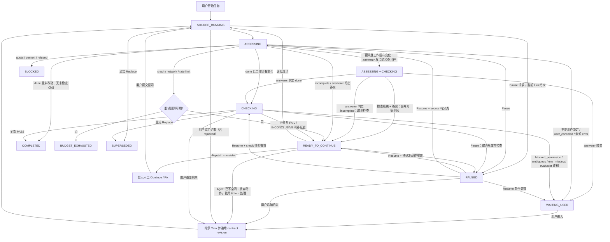

# 主 Agent 外部持续监督器设计

状态：提案，尚未实现。现状描述按代码 `786b759`（`server/gate.ts`、`server/ledger.ts`、`shared/schema.ts`）校对；现有实现见 [design.md](design.md) 与 [turn-outcomes.md](turn-outcomes.md)。

本文设计一个运行在主 Agent 之外的任务级监督器。它不替代 Codex `/goal`，也不要求用户输入新命令；启用策略后，监督器从用户发起的主 Agent 任务开始，持续检查需求完成度、代码质量和可恢复异常，并在安全边界内驱动主 Agent 继续工作，直到达到可审计的完成条件，或进入明确的停止状态。

## 1. 现状、问题与结论

### 1.1 现有实现已经做到的

当前插件已经不是单纯的“一轮一检”，任务跨轮的能力分散在几处：

| 能力 | 现有实现 |
| --- | --- |
| 检查 | `on_outcome.done` 的有序检查列表（`verify`、`review`），串行执行，第一个 FAIL 结束本轮；CRITICAL/HIGH finding 由代码强制按 FAIL 处理 |
| 修复循环 | `on_fail.fix.max_rounds`（1–5，默认 2）按整个任务计；修复轮从第一项检查重新开始，diff 始终以任务起点为基线 |
| 跨轮任务 | `chains` 表：代答、重试的轮次沿用链起点的基线和冻结策略；`request_text` 累积“Follow-up from the user”和“Answered on the user's behalf”，并附最多 5 条更早的用户消息，超过 8000 字符从中间截断 |
| 未通过改动的延续 | `carries` 表：SUPERSEDED、NEEDS_HUMAN、用户停止的改动交给下一个被检查的轮次，保留基线、请求、已用修复轮次；`checked_tree` 让“结束在已判 FAIL 的同一棵树上”的轮次不再重复检查；24 小时过期 |
| 重启中的轮次 | `turn_snapshots` 表：`turn_started` 冻结的策略和基线落盘，插件重载或 daemon 重启后该轮仍按原基线检查 |
| 无进展保护 | 修复轮没改文件时不重新检查：提问转代答，反驳 findings 转 NEEDS_HUMAN（检查者看不到被检查者的辩解） |
| INCONCLUSIVE | `inconclusive_reason`：`blocked_permission`/`ambiguous_request` → NEEDS_HUMAN；`no_test_infra`/`other` 在 `on_inconclusive: "fail"` 时按 FAIL；`env_missing` 只报告 |
| 代答 | answerer 子 Agent，`delay_seconds` 宽限期（默认 60 秒）内用户回复则取消；`answerRisk` 二次检查；同一问题再问即转交 |
| 权限 | `permissions.ts` 自动批准常规请求、高风险请求上卡；`permission_wait_minutes` 后代为拒绝，并追问检查者一次结论 |
| 检查者改动 | reviewer/verifier 期间 tree 变化 → verdict 作废、NEEDS_HUMAN、写 carry；answerer 期间 tree 变化 → 不发送答案 |
| 同仓库并发 | 内存中记录同一 repo 重叠运行的其他 Agent，写进检查 prompt、卡片和修复消息（“只修你自己的改动”），不阻止并行 |
| 恢复 | 第一个 hook/RPC 取得 SDK handle 后立即 `reconcile`，之后每 60 秒一次；`DISPATCHING` 用同 id/key 重放 create，`FIXING` 按 messageId 对账，链上到期的重试和代答照常启动 |
| 卡片 | 检查卡每轮一张（`post-turn-gate:<run>:round:<n>`）；任务链卡每个新事件一张（`post-turn-gate:outcome:<chain>:<seq>`），旧卡关闭并写“Continued in a newer card below.” |

### 1.2 仍然存在的问题

- **一个任务的状态分在四类记录里**：`gate_runs`、`chains`、`carries`、`turn_snapshots` 各有生命周期和删除时机，靠 `applyCarry`、`ensureChain`、`rounds_used` 等互相传递。每修一个衔接缺口（a3aafab、5853f5d、ba174d7、b74980c、786b759）都是在这些交接点上补洞。
- **三条发送路径各自判断**：fix（要求 `idle`）、answer 和 retry（`idle` 或 `error`）分别“先 refresh、后 send”。Paseo 的 `send()` 会取消运行中的 turn（design.md V5），这个窗口只被缩小（宽限期、两步之间不 await），没有消除。
- **预算互不相关**：修复轮次按任务计，代答次数和重试次数按链计，没有任务级总上限、墙钟上限或跨类型的无进展检测。
- **并发只提示不隔离**：重叠检测只在内存里，重启前已在运行的 turn 看不到；检查者与源 Agent 共用工作目录。
- **提问和检查只能串行**：Agent 做完改动后停下提问（例如“需要现在 commit 吗？”），任务先进 `chains` 等宽限期、跑 answerer、发答案，答案那一轮以 `done` 结束后才建 run 开始检查，卡片也分成两张。两套状态机不能同时持有一个任务；检查者与源 Agent 又共用目录，检查期间源 Agent 一改文件 verdict 就作废，所以 v2 也不能让它们重叠。答案那一轮没有改动工作区时（commit、确认、“继续”后什么都没改），这次检查审的是同一棵 tree，完全可以提前做。
- **“完成”只有局部定义**：INCONCLUSIVE、`report` 模式的 FAILED 都是终态；工作区没变化的 turn 不检查，这对“只分析不改码”的任务是正确的，但也意味着没有统一的完成契约。

### 1.3 结论

新能力应是一个独立的深模块 `CompletionSupervisor`：对外只有事件输入和生命周期控制，对内统一拥有任务状态、检查调度、继续决策、预算、持久化和所有自动发送。现有的 run、chain、carry、turn snapshot 合并为一条 Task 记录；`outcome.ts`、`prompts.ts`、`permissions.ts`、`reviewer.ts`、`git.ts` 作为内部模块原样复用，而不是继续扩张彼此交接的几套状态。

与 v2 的关系：supervisor 替换的是编排层，不是检查能力。

| | 处理方式 |
| --- | --- |
| 被替换 | `gate_runs`、`chains`、`carries`、`turn_snapshots` 及其交接逻辑 → 一个 Task 状态机；fix、answer、retry 三条发送路径 → 一个派发器 |
| 原样复用 | `outcome.ts`、`prompts.ts`、`permissions.ts`、`reviewer.ts`、`git.ts`，卡片组件，策略中的 `trigger` 和 `agents` |
| 新增 | 完成契约、任务级预算与无进展检测、Requirement Revision、Pause/Resume、提问期间的提前检查（§8.1）、按宿主能力提升的保证级别（§11.1） |

在同等宿主能力下 supervisor 是 v2 的严格超集，v2 的行为是它的一种策略配置，因此可以直接覆盖现有实现，而不是与之并存。覆盖的前提见 §18：先功能对等再删除旧路径、v2 策略文件按原语义解释、升级时 ledger 中未结束的记录不能被新旧两套同时拥有发送权。

## 2. 目标与非目标

### 2.1 目标

- 以一次用户任务为持续监督边界，而不是以一次 turn 为边界。
- 主 Agent 认为自己完成后，独立验证需求完成度与代码质量。
- 主 Agent 因可恢复异常、遗漏或检查失败而停止时，生成有证据的继续提示并自动派发；宿主支持原子条件发送时用它消除与用户输入的竞态。
- **在同等宿主能力下是 v2 的严格超集**：今天的 Paseo 上就提供 v2 的全部自动化（检查、自动修复、代答、重试）。宿主能力只决定保证级别（§11），不决定功能有无。
- 用户随时拥有最高控制权；用户输入、取消和需要真实决策的场景不会被自动化越权。
- 所有自动副作用均可追踪、幂等、可在插件重启后恢复。
- 用预算与进展检测保证监督有界，避免“永不停止”或重复消耗。
- 在主时间线上用任务卡解释当前阶段、证据和停止原因；任一时刻只有一张活动卡。

### 2.2 非目标

- 不实现或覆盖任何宿主原生命令，包括 Codex `/goal`。
- 不承诺主观意义上的“绝对完美”；只承诺满足明确的完成契约。
- 不把模型评审当作安全边界或形式化证明。
- 不自动回答产品取舍、凭据、权限、付款、发布等必须由用户决定的事项（沿用 answerer 的 escalate 规则与 `answerRisk`）。
- 第一阶段不在 context/quota 耗尽后创建替代主 Agent；这需要独立的上下文交接设计。
- 不允许 verifier/reviewer/answerer 修改工作区，也不自动回滚它们造成的修改。
- 不因缺少宿主能力而关闭功能。缺少时沿用 v2 已验证的缓解措施（§11），把剩余风险写在卡片和 README 上，而不是把风险的消除当成发布门槛。

## 3. 领域模型

| 术语 | 定义 |
| --- | --- |
| Task | 从一条真实用户请求开始，由其主 Agent 工作轮、监督器继续轮和检查轮组成的持久任务。取代现有的 run + chain + carry + turn snapshot。 |
| Source Agent | 承担用户任务的主 Agent。沿用现有识别规则：`trigger` 命中，`post-turn-gate.managed=true` 的 Agent 及其后代（沿 `paseo.parent-agent-id` 最多上溯 10 层）永远不是 Source Agent，插件创建的子 Agent 在创建前登记。 |
| Attempt | Source Agent 的一次 turn；来源为 `user`、`user_update`、`continue`、`fix`、`answer` 或 `retry`。 |
| Check | 对当前任务快照执行的一次 verifier 或 reviewer 检查。 |
| Answer | 对 Source Agent 停下提问的一次 answerer 调用；它不是 Check，不参与完成判定。 |
| Completion Contract | 判定任务可以结束所必须同时满足的、可审计的条件。 |
| Human Boundary | 需要用户选择、授权或提供外部信息，监督器不得代答的边界。 |
| Progress Fingerprint | 用于判断连续轮次是否真正取得进展的稳定摘要。 |
| Planned Action | 已持久化、尚未确认完成的一次发送、建子 Agent、更新卡片或归档操作。 |
| Requirement Revision | 原始请求及所有后续用户约束组成的、单调递增的完成契约版本。 |
| Workspace Lease | 以规范化工作区为键，串行保护 Source Agent 自动工作和所有 evaluator 的持久租约。 |

**Task 何时创建**：沿用现状，只在 Source Agent 的 turn 改变了工作区、或做过工作（有 tool call）后才停下提问、或失败时创建 Task；纯聊天 turn（没有 tool call、工作区不变）不创建 Task，也不运行任何检查。这保持了 a5d6902 的“没改文件就不打扰”。

一个 Source Agent 同一时刻最多有一个 active Task。任何非终态 Task 收到真实用户输入时，安全默认值都是把输入追加为该 Task 的新 Requirement Revision：保留原始请求、初始基线、已解决及未解决项，同时使旧检查结果失效。现有实现的 `chainRequestText` 已按此方式累积文本；本设计把它提升为带 revision 号的结构化记录。`WAITING_USER` 下的输入同时作为待决问题的回答。用户在 turn 运行中发送新消息（outcome 分类为 `replaced`）同样是追加约束，不切换 Task。只有用户点击 `Replace task`，才把旧 Task 标记为 `SUPERSEDED` 并创建新 Task。该关联由事件类型和显式控制决定，不依靠模型猜测文本意图。

追加约束必须在收到该用户 turn 的首个 lifecycle event 时以单个事务完成，并先于该 turn 的任何其他监督器处理：追加原文及事件 id、递增 contract revision、废弃尚未派发的自动 action（包括宽限期内的代答和待发重试，现状见 `snapshotTurn`），并把正在运行或已完成的旧 revision checks 标为 stale。新 attempt 仍属于原 Task，并以累计 Completion Contract 为验收依据。

用户消息与插件消息的区分沿用现有 messageId 前缀（`ptg:<run>:fix:<n>`、`ptg:answer:`、`ptg:retry:`，supervisor 改用 `pts:` 前缀）；这依赖本地约定，见 §20。

## 4. “完成”的可执行定义

监督器只在下列条件同时成立时标记 `COMPLETED`：

1. **需求验证通过**：verifier 根据最新 Requirement Revision 中的原始用户请求、全部后续约束、仓库状态和执行证据返回 `PASS`。
2. **质量门通过**：reviewer 没有达到策略阻断级别的发现；默认 `HIGH` 与 `CRITICAL` 阻断。与现状一致，阻断级 finding 由代码强制判 FAIL，不信任 verdict 字段本身。
3. **证据充分**：适用的构建、类型检查和测试已执行，或 verifier 明确说明为何不适用。仅凭主 Agent 自述不能完成。
4. **无待处理人类边界**：没有未回答的问题、权限请求或外部决策。
5. **状态一致**：检查针对的树快照仍是当前快照，且检查 Agent 未修改工作区。

`INCONCLUSIVE` 不是通过，按现有 `inconclusive_reason` 分流：

| 原因 | 去向 |
| --- | --- |
| `no_test_infra`、`other`、未写 | Agent 能补的缺口：生成 continue/fix 提示（相当于现有 `on_inconclusive: "fail"`），计入 fix 预算 |
| `blocked_permission` | `WAITING_USER`，卡片附被拒绝的请求 |
| `ambiguous_request` | `WAITING_USER`，请用户澄清；用户回复成为新的 Requirement Revision |
| `env_missing` | `WAITING_USER`：缺凭证、服务或工具，Agent 修不了，用户补齐后回复即可继续 |

这一契约把“直到完美”收敛为“直到全部可配置门禁通过”。策略可以提高标准，但不能取消预算和人类边界。

## 5. 核心不变量

1. 每个 Source Agent 至多一个 active Task。
2. 每个 Task 至多一个影响 Source Agent 的 Planned Action 正在执行。
3. 只有 `CompletionSupervisor` 可以向 Source Agent 自动发送消息；检查、代答模块只能返回结果。向插件自己的子 Agent 发送（例如权限被拒后的追问 nudge）不受此限。
4. 用户事件优先于自动事件。收到新用户输入后，旧 contract revision 不得再派发 continue/fix/answer/retry。
5. 先持久化状态与 action id，再执行外部副作用；重启后通过相同 id 对账。
6. 每个 verdict 必须绑定 task、cycle、contract revision、策略快照和 git 树快照；过期 verdict 不参与完成判定。
7. 终态卡片必须在子 Agent 归档前发布，避免 UI 永久停留在 Running。
8. 任何 evaluator 或 answerer 的工作区修改都会使其结果失效，并令任务进入 `WAITING_USER`；监督器不擅自回滚，必须等待用户决定如何处理变更。
9. 达到时间、轮次、代答、重试或无进展预算时必须停止自动发送。
10. 同一规范化工作区内，插件派发的 Source Agent attempt 与 evaluator check 必须共同持有唯一 Workspace Lease，不得并行。插件自己派发的动作之间总能保证这一点；对用户直接启动的 turn 的排他性取决于宿主能力（§11.3）。
11. 自动 continue/fix/answer/retry 只经过 supervisor 的统一派发器：宿主提供原子 `sendIfIdle(expectedRevision)` 时使用它；否则按 best-effort 协议，刷新后确认 Agent `idle`（retry 和 answer 也接受 `error`），与 `send()` 之间不 await 任何其他操作。确认失败即放弃该动作，不排队重发。
12. 非终态 Task 上的用户追加输入必须继承原始请求、初始基线、Completion Contract 和未解决项；只有显式 replace 可以切换 Task。
13. 每个 verdict 都经过前后 tree 对比：检查期间工作区有变化，verdict 作废（不变量 8）。宿主能为 evaluator 指定 cwd 时，evaluator 运行在绑定被检快照的隔离 worktree 中，源工作目录不会被它污染；不能指定时在原工作目录运行，与 v2 相同。
14. 用户停止 Source Agent 不等于接受其改动：停止前的改动留在 Task 范围内，由下一次检查覆盖（现状见 a3aafab）。

## 6. 模块边界

`CompletionSupervisor` 是面向插件入口的深模块。它接受依赖，返回结果；Paseo 生命周期 hook、RPC 和启动恢复都通过同一事件接口进入，不让调用者拼装内部工作流。

```ts
type SupervisorEvent =
  | { type: "turn_started"; event: TurnStartedEvent }
  | { type: "turn_ended"; event: TurnEndedEvent }
  | { type: "permission_requested"; event: PermissionRequestedEvent }
  | { type: "permission_resolved"; event: PermissionResolvedEvent }
  | { type: "control"; taskId: string; action: "pause" | "resume" | "stop" | "replace" | "stop_answering" }
  | { type: "reconcile" }; // 启动后第一次拿到 SDK handle、60 秒周期、到期定时器

interface CompletionSupervisor {
  accept(event: SupervisorEvent, paseo: Paseo): void;
  idle(): Promise<void>;
  close(): Promise<void>;
}
```

`accept` 只负责排队，避免阻塞 Paseo hook（30 秒超时，design.md V4）。现有实现是一个全局串行队列（`enqueue`，标了 `ponytail:`）；supervisor 改为事件先按规范化 workspace key 路由到串行队列，再在队列内按 Task 处理。只有不同工作区可以并行；指向同一工作区的不同 Source Agent 也必须竞争同一 Workspace Lease。子 Agent 的事件根据持久化 owner 映射（§10 `supervisor_children`）路由回相同工作区队列。

内部实现建议分为以下模块：

```text
index.server.ts
    │ lifecycle event / RPC / reconcile timer
    ▼
CompletionSupervisor ───────────────► TimelinePresenter
    │ owns state and all sends              │ one active card per task
    ├── OutcomeClassifier   (server/outcome.ts)
    ├── DecisionEngine
    ├── CheckRunner ────────────────► verifier / reviewer agents
    ├── AnswerRunner ───────────────► answerer agent
    ├── PermissionPolicy    (server/permissions.ts)
    ├── PromptBuilder       (server/prompts.ts)
    ├── RoleResolver        (server/reviewer.ts)
    ├── WorkspaceLeaseManager
    └── SupervisorStore ────────────► SQLite
                 │
                 └──────────────────► Planned Action outbox
```

- `DecisionEngine` 是纯函数：输入任务快照、outcome、check/answer 结果和预算，输出下一状态与 action，不执行副作用。
- `SupervisorStore` 是持久化 seam；生产使用 SQLite，测试可使用内存 adapter。
- `AgentRuntime` 封装 Paseo 的 refresh/send/create/archive/timeline/permission/config 操作。它同时有生产与测试 adapter（现有 `gate.test.ts` 的 fake paseo 可直接演化），因此值得成为 port。
- `CheckRunner` 只能为固定快照准备工作目录（`worktree` 级别下创建隔离 worktree）、创建和归档 evaluator、处理其权限等待与 nudge、收集 verdict；它不能向 Source Agent 发送消息。
- `AnswerRunner` 负责代答的宽限期、answerer 调用、escalate 规则、`answerRisk` 与同题检测；它只返回“答案或转交”，由 supervisor 决定是否发送。
- `PromptBuilder` 从任务证据生成 continue/fix/answer/retry 提示，禁止自由读取隐式全局状态。
- `TimelinePresenter` 维护每个 Task 的当前卡片序号：同一事件原地更新，新事件在当前位置新开一张并关闭旧卡（§13）。
- `WorkspaceLeaseManager` 规范化工作区身份，并用持久 lease 串行化该工作区的自动 source attempt 与所有 checks。

测试从 `CompletionSupervisor` 公共接口进入。私有状态函数只在复杂纯逻辑确有必要时单测，避免测试与实现细节绑定。

## 7. 状态机

### 7.1 状态

| 状态 | 含义 |
| --- | --- |
| `SOURCE_RUNNING` | Source Agent 正在执行用户或监督器派发的 attempt。 |
| `ASSESSING` | 分类 Source Agent 的结束原因并确定下一步；预筛命中提问时在此运行 answerer（含宽限期），工作区有改动时同时进行提前检查（§8.1）。 |
| `CHECKING` | 持有 Workspace Lease，串行执行 completion/quality checks；隔离 worktree 可用时在其中运行，否则在原工作目录（§11.1）。 |
| `READY_TO_CONTINUE` | 已生成继续动作，等待派发器发送（到期的宽限期或重试延迟）；`dispatch: "assisted"` 时等待用户人工提交。 |
| `WAITING_USER` | 需要真实用户输入，暂停所有自动化。 |
| `PAUSED` | 用户主动暂停，或一个无需补充业务信息的可恢复操作条件暂时不满足；禁止自动副作用。 |
| `COMPLETED` | 完成契约全部通过。 |
| `BLOCKED` | 当前 Task 无法安全恢复的永久失败。它是终态，只能创建继承契约的新 Task，不能 Resume。 |
| `BUDGET_EXHAUSTED` | 时间、轮次、代答、重试或无进展预算耗尽。 |
| `CANCELED` | 用户点击 `Stop supervision`。 |
| `SUPERSEDED` | 用户点击 `Replace task`，新任务替代了当前任务。 |
| `ERROR` | 插件内部不可恢复错误（持久状态损坏、子 Agent 无法创建等）；provider 返回的 `error` 类失败不属于这里。 |

`COMPLETED`、`BLOCKED`、`BUDGET_EXHAUSTED`、`CANCELED`、`SUPERSEDED`、`ERROR` 为终态，任何 control 都不能使它们重新发送。`WAITING_USER` 只能由下一条真实用户输入恢复同一个 Task。`PAUSED` 只能由显式 `resume` control 恢复；普通用户消息仍按 Requirement Revision 规则追加到 Task，并作为新的用户 attempt 进入 `SOURCE_RUNNING`。

终态 Task 上未通过检查的改动（`BLOCKED`、`BUDGET_EXHAUSTED`、`ERROR`）不视为已接受：同一 Source Agent 的下一条用户输入创建的新 Task 继承其基线与请求，与现有 carry 语义一致（包括 24 小时过期，以及“结束在同一棵已判 FAIL 的树上则不再检查、改动按原样保留”）。`CANCELED` 和 `SUPERSEDED` 是用户显式放弃监督，不继承。

`pause` 可以在 `SOURCE_RUNNING`、`ASSESSING`、`CHECKING` 或 `READY_TO_CONTINUE` 请求。若 Source Agent 已在运行，不取消该 turn，只禁止后续自动动作，并在 turn 结束后进入 `PAUSED`；若 evaluator 或 answerer 在运行，则取消并归档它、将 cycle 标为 stale，再进入 `PAUSED`。进入 `PAUSED` 前必须释放 Workspace Lease，并保证没有 `executing` action；未确认 action 只保留为恢复线索，不能直接重放。

`resume` 仅在以下条件全部成立时接受：Task 当前为 `PAUSED`；没有更新的 replace/cancel；最新 contract revision 仍可读取；工作区 lease 未被其他 Task 占用；恢复不会立即越过任何 attempt/answer/retry/no-progress 预算。恢复事务先废弃 pause 前未确认的 source/check actions，再由 `DecisionEngine` 根据持久事实选择唯一目标：有效的待派发 continue/fix/answer/retry 进入 `READY_TO_CONTINUE`；最新 source attempt 尚未分类则进入 `ASSESSING`；快照与 contract revision 仍匹配的未完成检查进入 `CHECKING`。若上述事实不再成立，则进入 `WAITING_USER` 或一个终态，不能猜测恢复。

暂停和恢复不重置 attempt、fix、answer、retry、check retry 或 no-progress 计数。`max_minutes` 只累计非 `PAUSED` 时间，使用持久化的 `paused_at` 与 `accumulated_pause_ms` 计算；恢复时若其他预算已经耗尽，原子转为 `BUDGET_EXHAUSTED`，不派发动作。

### 7.2 主流程



每次从 `CHECKING` 返回继续工作都会创建新 cycle，新 cycle 从检查列表第一项重新开始（修复可能破坏已通过的检查，与现状一致）。旧 cycle 的结果仍保留用于审计，但不会跨快照复用；唯一的复用是 §8.1 的“答案轮没改 tree”。

## 8. 决策规则

| Source outcome | 默认动作 | 说明 |
| --- | --- | --- |
| `done` | 工作区相对 Task 基线有变化时运行 completion + quality checks | 与现状一致：从未改动工作区的纯分析、纯聊天任务直接 `COMPLETED`，不启动 evaluator；有未检查改动（继承的基线）时照常检查。 |
| `incomplete` | 生成带缺口证据的 continue 提示 | 由现有预筛信号（`truncated`、`tool_last`、`todo_pending`）加 answerer 的 `incomplete` 判定得出。经统一派发器发送（§11.2）；计入 source-turn 与 no-progress 预算。 |
| `awaiting_user` | 先等 `delay_seconds` 宽限期，再由 answerer 判定；能从需求与仓库确定的由它作答，真实选择进入 `WAITING_USER`；工作区有改动时同时提前检查（§8.1） | 沿用现有 escalate 规则、`answerRisk`、同题相似度 ≥ 0.5 即转交；不把“继续”伪装成用户决定。宽限期内的用户输入取消代答。 |
| `refused` | `BLOCKED` | 与现状一致，不代答、不重试。若策略明确声明为可恢复的技术性拒绝，应直接进入 `READY_TO_CONTINUE`，不能先进入 `BLOCKED` 再 Resume。 |
| `crashed` / `network` / `rate_limited` | 延迟后 bounded retry | 现状为固定 `delay_seconds`、每类最多 3 次、默认不重试；supervisor 可改为指数退避。经统一派发器发送；使用同一 Task 和确定性 message id。失败后 Agent 状态为 `error` 也允许重试（E5、E6）。 |
| `quota_exhausted` / `context_exhausted` | `BLOCKED` | 同一 Agent 无法可靠恢复；schema 已禁止对它们配置 retry。未来可接入 successor handoff。 |
| `error`（provider 失败，文本未命中任何类别） | `WAITING_USER` | 保留错误原文，不猜测重试；用户回复后同一 Task 继续。插件自身的故障才是 `ERROR` 状态。 |
| `user_canceled` | `WAITING_USER` | 不发送任何自动消息；停止前的改动留在 Task 内，用户下一条消息继续同一 Task（不变量 14）。 |
| `replaced` | 不改变 Task | 被打断的 turn 由用户的新消息接替，新 turn 的 `turn_started` 已追加 Requirement Revision；基线沿用被打断的那一轮（现状见 turn-outcomes.md §7.1）。 |

检查结果规则：

- verifier `FAIL`：fix prompt 只包含未满足需求、证据和验收方式。
- reviewer 存在阻断级 findings：fix prompt 包含稳定 finding id，后续 cycle 必须逐项验证是否消失。
- reviewer 只有非阻断 findings：记录在完成卡片，但不强迫循环。
- 修复轮没有改动工作区：不重新检查、不消耗 fix 预算；回复是提问则走代答，否则视为反驳 findings，进入 `WAITING_USER` 并展示回复。检查者永远看不到被检查者的辩解（d2d75a0）。
- verdict JSON 无效：允许在 check retry 预算内重跑 evaluator；不能因此让 Source Agent 重做任务。现状是直接 `ERROR`。
- evaluator 的权限请求被拒（用户点拒绝，或 `permission_wait_minutes` 到期代拒）且没有给出 verdict：追问一次结论（nudge），截止时间至少顺延 5 分钟；只追问一次。
- evaluator 修改树：使整个 cycle 失效并进入 `WAITING_USER`，由用户决定如何处理意外变更。

### 8.1 提问期间的提前检查

Agent 做完改动后停下提问，是最常见的 `awaiting_user`。v2 在这里串行：等宽限期、跑 answerer、发答案、等答案那一轮结束，才开始检查。supervisor 用同一个 Task 同时持有两件事：

1. `awaiting_user` 且工作区相对 Task 基线有变化时，宽限期、answerer 与 completion + quality checks 同时启动。检查照常持有 Workspace Lease，并以提问时的 tree 为快照。answerer 只读、不跑构建，与检查并行不违反不变量 10。
2. 答案不在检查结束前发送。源 Agent 在检查期间保持空闲，所以不会出现“源 Agent 改文件导致 verdict 作废”；宽限期通常覆盖大部分检查时间，答案的实际延迟是 `max(宽限期 + answerer, 检查)`，而不是两者之和。
3. 两边结果合并为一个 source action：
   - 检查 PASS + 答案：只发答案；
   - 检查 FAIL + 答案：答案与 findings 合成一条消息，占一次代答和一次 fix；
   - answerer 判定其实已完成（`done`）：检查继续，结果即本 cycle 结论；
   - answerer 判定没做完（`incomplete`）：取消检查、丢弃结果，发“Continue.”；
   - answerer 转交用户：检查照常结束，`WAITING_USER` 卡片同时显示问题和检查结论；用户的回复成为新的 Requirement Revision。
4. 答案那一轮结束后：tree 与检查快照相同（commit、确认、“继续”后没改文件）→ 直接沿用这次 verdict，不重新检查；tree 变了 → 新 cycle，从第一项检查重新开始。
5. 用户在这期间发消息：与其他场景一样，取消未发的答案并追加 Requirement Revision；检查结果作废（contract revision 变了）。

`answer` 类 Requirement Revision 不使同一 tree 上的 verdict 失效：answerer 只能在原需求和仓库事实的范围内作答，产品取舍、范围扩大一律转交用户（§2.2），所以代答不扩大完成契约；答案若导致新的实现，tree 一定变化，检查自然重跑。用户本人的输入仍然使旧 verdict 失效。

代价是 answerer 判定 `incomplete` 时白跑一次检查。`supervision.check_while_asking` 可以关掉这一行为，回到 v2 的串行顺序。

## 9. 进展检测与预算

每个 attempt 完成后计算：

```text
progressFingerprint = hash(
  gitTreeSha,
  normalizedOutcome,
  unresolvedRequirementIds,
  unresolvedBlockingFindingIds,
  relevantCommandEvidence
)
```

以下任一变化可视为进展：git tree 改变；未满足需求减少；阻断 finding 被解决；新产生了此前缺失的有效测试/构建证据。仅改写总结文字不算进展。现有的两条规则是它的特例，应保留：修复轮 tree 不变不重新检查；结束在已判 FAIL 的同一棵树上（`checked_tree`）不重新检查。

建议默认预算：

| 预算 | 默认值 | 现状对应 |
| --- | ---: | --- |
| Source Agent 总 attempt | 12 | 无 |
| fix attempt | 2 | `on_fail.fix.max_rounds`（1–5，默认 2），按任务计 |
| 代答 | 3 | `awaiting_user.answer.max`（1–10，默认 3），按链计 |
| 可恢复异常 retry | 0（不自动重试） | `retry.max`（1–3），默认 `notify` |
| evaluator 无效输出 retry / check | 2 | 无（直接 ERROR） |
| 连续无进展 attempt | 2 | 部分：修复轮无改动不重检 |
| 墙钟时间 | 120 分钟 | 无；只有各角色 `timeout_minutes` |

默认值沿用 v2 的保守取值，避免启用 task 模式后自动发送的次数突然增加。任一预算耗尽即进入 `BUDGET_EXHAUSTED`，卡片显示最后缺口、最近证据和推荐的人工下一步。预算是硬上限，只能配置为有限的非负整数；fix 为 0 等价于现有 `on_fail: "report"`，retry 为 0 等价于 `notify`。

## 10. 持久化模型

不要继续把任务级状态塞入现有 `gate_runs`、`chains`、`carries` 或 `turn_snapshots`；新表取代它们，`gate_children`、`chain_children` 合并为 `supervisor_children`，`config_errors` 与任务无关，保持不变。新增任务、需求事件、attempt、check、子 Agent 登记、workspace lease 表和一个 action outbox：

### `supervisor_tasks`

- `task_id`、`source_agent_id`、`workspace_id`、`workspace_key`、`repo_root`
- `status`、`phase`、`cycle`
- `initial_request`、`contract_revision`、`policy_snapshot_json`、`completion_contract_json`
- `base_tree`、`current_tree`、`checked_tree`、`progress_fingerprint`
- `inherited_from_task_id`：继承自哪个终态 Task 的未检查改动（取代 `carries`）
- `source_attempts`、`fix_attempts`、`answer_attempts`、`retry_count`、`no_progress_count`
- `stop_answering`、`last_question`
- `concurrent_agents_json`：与本任务重叠运行的其他 Agent（现状只在内存中）
- `card_seq`、`card_json`
- `started_at`、`updated_at`、`deadline_at`、`paused_at`、`accumulated_pause_ms`
- `pause_reason_json`、`resume_target_hint`
- `last_error`、`terminal_reason_json`

通过约束或事务保证一个 `source_agent_id` 最多一条非终态记录。`policy_snapshot_json` 包含 turn 开始时读入并冻结的角色规则文件内容（现有 `loadRules`）。

### `supervisor_requirements`

- `(task_id, revision)` 主键
- `event_id`、`kind = initial | context | constraint | answer`（`context` 是任务开始前最多 5 条更早的用户消息）
- `content`、`received_at`
- `inherited_base_tree`、`unresolved_items_json`

该表只追加不改写。创建新 revision 与废弃旧 revision 的 actions/checks 必须在同一个事务内完成，确保任何恢复点都不会只看到追加约束而仍使用旧契约。拼给子 Agent 的请求文本仍按现有 `clipRequest` 从中间截断，保留原始请求和最新约束。

### `supervisor_attempts`

- `(task_id, sequence)` 主键
- `turn_id`、`turn_key`、`message_id`、`origin = user | user_update | continue | fix | answer | retry`
- `start_tree`、`end_tree`、`outcome`
- `reply_hash`、`evidence_json`、`started_at`、`ended_at`

attempt 行在 `turn_started` 时写入（含 `start_tree`），取代 `turn_snapshots`：插件在 turn 中途重载或 daemon 重启后，`turn_ended` 仍能找到它的基线。`turn_id` 用于忽略被打断 turn 迟到的 `turn_ended`（E4）。

### `supervisor_checks`

- `(task_id, cycle, check_name, attempt)` 主键
- `child_agent_id`、`snapshot_id`、`tree_sha`、`contract_revision`、`isolation_path`、`status`、`verdict`、`inconclusive_reason`
- `result_json`、`dispatch_json`、`blocked_json`（被拒绝的权限请求及是否已 nudge）、`started_at`、`ended_at`

`dispatch_json` 保存完整 create 参数，恢复时原样重放（同 key 必须同 payload，design.md V9）。

### `supervisor_children`

- `child_agent_id` 主键
- `task_id`、`role = verifier | reviewer | answerer`、`action_id`

在创建子 Agent 之前写入，保证它的事件（包括旧 cycle 子 Agent 的迟到事件）永远不会被当作 Source Agent。

### `supervisor_workspace_leases`

- `workspace_key` 主键
- `owner_task_id`、`owner_action_id`、`kind = source | check`
- `generation`、`acquired_at`、`expires_at`、`heartbeat_at`

`workspace_key` 由工作目录 realpath、git common dir 与实际 worktree identity 共同计算：同一路径共享 lease，独立 git worktree 可独立调度。lease 过期不能直接被抢占；必须先核对 owner Agent 已终止且工作区 fingerprint 稳定。

### `supervisor_actions`

- `action_id`、`task_id`、`kind`、`payload_json`
- `status = planned | executing | confirmed | abandoned`
- `attempts`、`not_before`、`last_error`、时间戳

`not_before` 同时承载代答宽限期和重试延迟（取代 `chains.answer_at`、`next_retry_at`）。action id 必须确定性生成，例如：

```text
pts:<task-id>:source:<attempt>
pts:<task-id>:check:<cycle>:<check-name>:<attempt>
pts:<task-id>:answer:<child-agent-id>
pts:<task-id>:card:<seq>
```

answerer 的 key 带子 Agent id 而不是序号：一次被转交或失败的调用不会增加代答次数，按序号生成会让下一次调用以新 payload 复用旧 key（`agent_request_key_conflict`，现状已修复过）。

## 11. 副作用、并发与幂等

一次自动动作遵循固定协议：

1. 在同一 SQLite 事务中推进状态并写入 `planned` action。
2. 获取对应 Workspace Lease；确认同工作区没有插件派发的 source/check 正在运行。
3. 刷新 Source Agent；确认 Task、contract revision 与工作区 fingerprint 仍匹配。
4. 通过满足该动作安全条件的宿主原语执行副作用。
5. 用可观察事实确认结果，再把 action 标记 `confirmed`。
6. 若进程在任意步骤崩溃，`reconcile` 根据 action id、lease generation 和 Agent 时间线决定确认、重试或放弃。

### 11.1 保证级别

supervisor 的每项能力都按宿主提供的原语选择保证级别。缺少原语时降到 v2 已在用的做法，功能不关闭；原语到位后自动升级，不需要改策略：

| 能力 | 宿主提供时 | 宿主不提供时（今天的 Paseo，等同 v2） | 剩余风险 |
| --- | --- | --- | --- |
| 向 Source Agent 发送 | `atomic`：原子 `sendIfIdle` | `best-effort`：refresh 后确认空闲，立即 `send()` | 两步之间用户正好发消息，会被插件的消息取消（V5） |
| evaluator 工作目录 | `worktree`：绑定快照的隔离 worktree | `in-place`：原工作目录 + 前后 tree 对比 | evaluator 的改动会短暂出现在源工作目录；verdict 已作废，改动不回滚 |
| 同工作区排他 | `exclusive`：能列举运行中的 Agent | `plugin-only`：插件派发的动作之间串行，外部 turn 靠内存重叠检测 | 插件启动前就在运行的外部 turn 看不到，其改动可能混进 diff |

卡片始终显示当前生效的级别（§13），剩余风险写进 README。启动时和每次 reconcile 时做一次 capability probe，结果只影响级别，不影响 Task 状态。

### 11.2 Source Agent 发送

建议的宿主原子语义：

```ts
send({
  message,
  messageId,
  ifAgentIdle: true,
  expectedTimelineRevision,
});
```

宿主必须在一个不可分割的操作中验证 Agent idle（或失败后的 `error`）且 timeline revision 未变化；条件不满足时不得取消、替换或修改任何 turn，并返回可区分的 conflict 结果。conflict 表示用户已经接手：放弃该 action，按用户 turn 处理（§3）。

没有该原语时使用 best-effort 协议，即现有 v2 的 fix、answer、retry 已在用、并经过真实 kiro 端到端验证的做法：

1. action 先以 `planned` 落盘，messageId 确定（`pts:<task>:source:<attempt>`）；
2. refresh Source Agent，确认状态为 `idle`（retry 和 answer 也接受失败后的 `error`），且 Task 与 contract revision 未变；
3. 与 `send()` 之间不 await 任何其他操作（卡片更新放在发送之后）；
4. 确认失败即放弃该 action，不排队重发；用户的 turn 会按 §3 追加到 Task；
5. 代答保留 `delay_seconds` 宽限期（默认 60 秒）：用户最可能在 Agent 刚停下时回复，宽限期让这段时间里不发生自动发送；
6. 重启后按 messageId 在 timeline 中对账，找不到才用同一 messageId 重发。

两种协议共用同一个派发器和同一套 action 状态，差别只在第 2–3 步是否由宿主原子完成。`dispatch: "assisted"` 是用户可选的第三种方式：只在卡片上提供 `Prepare Continue` / `Prepare Fix` / `Prepare Answer`，用于复制或预填到输入框，插件不调用 Source Agent 的 `send()`。它适合希望逐条确认的用户，不是缺少宿主能力时的降级。

### 11.3 共享工作区调度

Workspace Lease 覆盖同一工作区内所有插件派发的 source attempts、verifier 和 reviewer；同一 Task 的 checks 也严格串行（两个 evaluator 同时构建和测试会互相干扰，与 v2 相同）。调度前必须同时满足：

- lease 可安全获取；
- 已知的同工作区 Source Agent 均不在运行；
- 当前 fingerprint、Task 和 contract revision 与 planned action 一致。

`worktree` 级别下，evaluator 在由 `snapshot_id` 构造的临时隔离 worktree 中运行（现有 `snapshotTree` 的临时 index 快照已包含 tracked 与未忽略的 untracked 内容，可直接用 `git worktree add` 或 `read-tree` 物化），构建产物、测试写入或意外编辑都不会带回 Source Agent 工作目录；隔离 worktree 仍继承 Source Task 的 `workspace_key` 和 lease，不增加并发度。`in-place` 级别下，evaluator 在原工作目录运行，前后 tree 对比发现改动即作废 verdict、进入 `WAITING_USER`（不变量 8），与 v2 相同；未被 git 忽略的构建产物也会触发这一条，应加进 `.gitignore`。两种级别下 verdict 都绑定快照 tree。answerer 只读代码、不跑构建，始终留在原工作目录，并在结束时比对 tree。

用户直接启动的 turn 不受插件 lease 阻塞。若这类 turn 在 check 或自动 source attempt 期间出现，监督器立即把 lease 标为 contended，停止派发新动作，并尽力取消 evaluator；即使隔离 worktree 防止了文件互扰，该 cycle 的所有 verdict 仍无条件 stale。待所有已知同工作区 Source Agent idle 后重新读取 fingerprint：若变更无法归属到唯一 Task，相关 Task 进入 `WAITING_USER` 并请求用户选择归属，不自动合并或完成。

“已知”的范围取决于级别：`exclusive` 下来自宿主列举的运行中 Agent；`plugin-only` 下来自插件看到的 `turn_started`/`turn_ended`（现有 `startActivity`，supervisor 把它落盘，重启后仍记得已开始未结束的 turn）。`plugin-only` 下插件启动前就在运行的外部 turn 不可见；与 v2 一样，检查 prompt、卡片和 fix 消息会注明重叠的 Agent，并要求只修自己的改动。用户本来就在独立 git worktree 中启动的 Task 具有不同 worktree identity，可各自持有 lease 并行，这也是彻底避免互扰的推荐做法。

## 12. 崩溃恢复

`reconcile` 执行以下步骤：

1. 查询所有非终态 Task 和未确认 action。
2. 刷新 Source Agent 与仍存在的 evaluator/answerer。
3. 以时间线中的 message id、child id 和卡片 id 对账，禁止盲目重复副作用。
4. 结束已终止但未落库的 attempt/check/answer；对仍在运行、有待处理权限请求但卡片上没有按钮的子 Agent，按 `pendingPermissions` 重新走自动批准或上卡。
5. 重新排队已到期且仍安全的 retry/continue/answer。
6. 对可恢复的临时运行时不可用进入 `PAUSED`；对已确认不可恢复的 Agent 丢失或持久状态损坏进入 `BLOCKED`/`ERROR` 并发布终态卡片。
7. 存储的策略快照无法按当前 schema 解析（插件升级跨越了一个运行中的任务）时，转 `ERROR` 并说明原因，与现状一致。

现有实现可以直接复用的对账手段：`DISPATCHING` 用同 id/key 重放 create；按 messageId 在 timeline 尾部（最多 500 条，标了 `ponytail:`）查找已发送的 fix；子 Agent 已 idle 时 `timeline.refetch` 取回结果再 finalize。

当前插件在 daemon 重启后，只有收到第一个 hook 或 RPC 才能取得 Paseo SDK handle（V1），之后每 60 秒对账一次，并用定时器准时启动到期的代答和重试；因此无法在完全无事件时主动 reconcile。这是宿主接口限制。实现阶段应先在取得 handle 后立即恢复；同时向 Paseo 提议在 `createServerPlugin(context)` 中提供 SDK 或 ready hook。另外，“卡片上的请求何时上卡”现状只在内存中，重启后 `permission_wait_minutes` 从头计时；supervisor 应把它落到 `supervisor_checks.blocked_json` 或 action 上。

## 13. 用户交互

每个 Task 在主时间线上任一时刻只有一张活动卡片。同一件事的进度原地更新，提问期间的提前检查（§8.1）也是同一件事：问题、答案和各项检查结论显示在同一张卡上；每个需要用户关注的新事件（新 cycle 的检查、新的提问、新的失败或重试、终态）以 `card_seq + 1` 在时间线当前位置新开一张，旧卡最后更新一次：按钮去掉，仍在进行中的状态改为“已在下方新卡片继续”。这是现有卡片从“每链复用一张”改过来的教训（26132e8、turn-outcomes.md §5）：更新时间线上方很远的旧卡，用户看不到，Paseo 也会让新一轮看起来没有卡片。

活动卡片至少显示：

- 当前状态与阶段；
- 原始任务摘要与 contract revision；
- attempt、fix、代答、retry、无进展和时间预算；
- 当前 git 快照；
- verifier/reviewer 最新结论、每项检查的状态（含 INCONCLUSIVE 原因）及阻断项（最多 10 条，其余计数，保证卡片数据小于 64 KiB）；
- 被拒绝的权限请求、Agent 对 findings 的反驳；
- 同工作区重叠运行的其他 Agent；
- 最近一次自动动作和下一步；
- 子 Agent 的标题和 id（renderer 没有 navigation，V16），终止原因和可复制的 `paseo logs <id>` 命令。

卡片提供：

- 权限请求的按钮：子 Agent 上交的请求显示标题、命令或路径、上交原因，按 provider 给出的 actions 渲染（例如 kiro 的 Yes / Always / No），与现状相同；
- `Pause supervision`：停止派发后续自动动作；当前 Source Agent turn 自然结束，运行中的 evaluator/answerer 被取消并作废；
- `Stop supervision`：立即转为 `CANCELED`，不终止正在运行的用户主 turn，但禁止后续自动动作；
- `Stop auto-answering`：只关闭本 Task 的代答，问题交给用户，其余监督照常（现有按钮）；
- `Resume`：仅在 `PAUSED` 可用；保留全部计数并重新验证契约、快照、lease 和预算后，由 `DecisionEngine` 选择恢复目标；
- `Prepare Continue` / `Prepare Fix` / `Prepare Answer`：仅 `dispatch: "assisted"` 时出现，只复制或预填提示词，不调用 Agent `send()`；
- `Replace task`：显式结束当前 Task，下一条用户输入从新契约开始；
- `Continue once`：`WAITING_USER` 或 `BUDGET_EXHAUSTED` 前最后一个待派发动作的人工单步，按当前保证级别发送，不提高任何预算上限。

卡片必须显示当前生效的保证级别（§11.1），例如 `dispatch: best-effort · checks: in-place · exclusivity: plugin-only`，并链接到剩余风险说明；`dispatch: assisted` 时写明需要用户提交。待发送的动作显示预计时间（宽限期、重试延迟），用户不应从“Running”误以为插件正在后台等待机会。

这不是 slash command：用户无须学习额外命令，卡片只是透明度和紧急制动界面。

发布顺序必须是：持久化终态 → 更新 Source Agent 卡片 → 归档子 Agent（现状见 e0165ae；不使用 `autoArchive`，它在子 Agent 空闲时就触发，早于插件解析结果）。卡片更新失败时保留可重试 action，不因 child 已停止而显示永久 Running。

## 14. 权限与信任边界

- verifier、reviewer 和 answerer 的提示词由插件内置的角色职责和 JSON 契约，加上仓库里的 `.paseo/post-turn-gate/<role>.md` 与 `instructions`（合计不超过 20000 字符）组成，不依赖 Paseo profile；profile 只提供启动设置。supervisor 本身不是 Agent，没有提示词。
- 规则文件在 turn 开始时读取并冻结；路径必须在仓库内，按 `realpath` 判断，指向仓库外的软链接被拒绝。
- 子 Agent 的权限请求沿用 `permissions.ts`：常规请求（读、搜索、构建、测试、仓库内编辑）以 `allow_once` 自动批准；不可逆、对外、提权、凭据相关、仓库外路径，以及 plan/question/mode 类请求上卡由用户决定；`permissions: "ask"` 全部上卡。仓库内编辑虽被自动批准，仍会使 verdict 失效（§8），在隔离 worktree 中则不影响源工作目录。
- Codex 子 Agent 一律以 `plan_mode: false` 启动：Plan 模式的 turn 以计划确认请求结束，拿不到结构化结果。
- Source Agent 的权限仍由宿主管理，监督器不能代替用户批准危险操作；answerer 的答案也不能批准它们（`answerRisk`）。
- 仓库内策略和提示词属于可信项目配置，但不是抵御恶意仓库内容的安全沙箱；Agent 可以改写策略，关掉后续轮次的监督。
- evaluator 被明确要求只读；任何树变化都使结果失效。插件只报告变化，不执行破坏性回滚。
- 任务记录可能包含用户需求和评审摘要，保存在本地 `${PASEO_HOME:-~/.paseo}/plugin-data/post-turn-gate/ledger.sqlite`，不额外上传。

## 15. 策略草案与兼容性

建议在下一版 schema 中引入一个任务级块，保留现有 `trigger`、`agents`（含 `instructions_file`、`permissions`、`timeout_minutes`、`permission_wait_minutes`）语义：

```json
{
  "version": 3,
  "supervision": {
    "mode": "task",
    "dispatch": "auto",
    "checks": ["verify", "review"],
    "blocking_severity": "HIGH",
    "answer_delay_seconds": 60,
    "check_while_asking": true,
    "budget": {
      "max_source_attempts": 12,
      "max_fix_attempts": 2,
      "max_answers": 3,
      "max_retries": 0,
      "max_check_retries": 2,
      "max_no_progress_attempts": 2,
      "max_minutes": 120
    }
  }
}
```

推荐迁移策略：

- v2 文件按 `mode: "turn"` 解释，保留现有行为，不静默切换到 task 模式。task 模式与 v2 功能对等后（§18 第 3 步），`mode: "turn"` 只作为兼容入口，内部由 supervisor 以 v2 语义实现。
- 新初始化默认生成 `mode: "task"`，同时生成项目定制的 verifier/reviewer/answerer 规则。`post-turn-gate-init` 仍输出每个字段的默认值，并保留“初始化输出与 schema 默认值一致”的测试。
- `dispatch: "auto"`（默认）自动派发，按 capability probe 的结果使用 `atomic` 或 `best-effort`（§11.1），不会因缺少能力而降级为人工提交；`"assisted"` 是用户显式选择的人工提交。v2 的自动修复、代答、重试对应 `"auto"`。
- v2 到 v3 的映射：`on_outcome.done` 的检查列表 → `checks`（`notify`/`ignore` 表示不检查）；`on_fail.fix.max_rounds` → `max_fix_attempts`，`"report"` → 0；`on_inconclusive` → §4 的分流（`"report"` 时 `no_test_infra`/`other` 只报告，不发回）；`awaiting_user.answer.max`/`delay_seconds` → `max_answers`/`answer_delay_seconds`，`as_done` 与 `ignore` 需要显式对应；各失败类的 `retry.max` → `max_retries`（v3 若要按类别区分，保留 per-category 结构而不是合并）；`retry.message` 保留。解析时若语义冲突应报错，不能猜测。
- 升级期间，已有 v2 run 和 chain 允许按旧实现结束，已有 carry 由 v2 路径消费；v3 只接管升级后新创建的 Task，避免双重发送。
- 插件版本与远程 initializer revision 必须一致，防止旧插件读取新 schema；现有插件遇到存储的策略格式过旧会把 run 转 `ERROR`、丢弃 chain，v3 需要同样的保护。

## 16. 测试策略

### 决策与不变量测试

- 对每种 outcome、verdict、INCONCLUSIVE 原因、预算边界建立决策表测试。
- 属性测试验证一个 Source Agent 不会存在两个 active Task、终态不会再次发送、过期 verdict 永不通过。
- progress fingerprint 对等价文本稳定，对真实证据变化敏感。
- `outcome.ts`、`permissions.ts` 的现有单测（E1–E6 真实 payload、Codex 措辞、命令切分）继续作为分类与权限的回归基线。

### 状态机集成测试

沿用现有测试方式（`node:test`，真实临时 git 仓库和 SQLite，fake Paseo），把 fake 收敛为 `AgentRuntime` 测试 adapter，从公共 `CompletionSupervisor.accept()` 驱动：

- done → checks pass → completed；未改动工作区的 done 不启动 evaluator；
- review fail → fix → recheck → completed；修复轮无改动不重检，提问转代答、反驳转 `WAITING_USER`；
- incomplete → continue，连续无进展后停止；
- awaiting_user → 宽限期内用户回复则不代答；到期代答；同题再问与 `answerRisk` 命中时转交；
- 提问且工作区有改动 → 检查与 answerer 并行，答案在检查结束后才发；FAIL 时答案与 findings 合成一条消息；答案轮 tree 不变时沿用 verdict、不再检查，tree 变化时重新检查；answerer 判定 `incomplete` 时检查被取消；`check_while_asking: false` 时回到串行；
- crash/network/rate limit 按预算退避重试；
- context/quota 直接 blocked；未知 `error` 进入 `WAITING_USER`；
- user_canceled 保留改动，下一条用户消息在同一 Task 内检查它们；
- replaced 不切换 Task，被打断 turn 的迟到 `turn_ended` 不影响新 turn；
- 插件在 turn 中途重载后，`turn_ended` 仍按 attempt 行里的基线检查；
- pause 不取消运行中的 Source Agent turn，进入 `PAUSED` 后不会自动发送；
- resume 只接受 `PAUSED`，并分别覆盖恢复到 `READY_TO_CONTINUE`、`ASSESSING`、`CHECKING` 及条件失效的路径；
- resume 不重置计数，暂停时间不计入 `max_minutes`，其他预算已耗尽时直接 `BUDGET_EXHAUSTED`；
- `BLOCKED` 上的 resume 被拒绝，且终态不会产生任何新 source/check action；
- `atomic` 级别下 continue 与用户输入竞争时，条件失败且用户 turn 不被取消；
- `best-effort` 级别下 refresh 与 `send()` 之间没有 await；refresh 看到 Agent 不空闲时放弃动作，用户的 turn 追加到 Task；宽限期内的用户输入取消代答；
- `dispatch: "assisted"` 时任何路径都不会调用 Source Agent `send()`；
- capability probe 结果变化只改变保证级别，不改变 Task 状态；
- 执行中和检查中追加约束时，原 Task 的请求、基线和未解决项被继承，旧 checks/actions 失效；
- 只有显式 replace 才创建不继承契约的新 Task；
- 同工作区两个 Source Agent 的自动 source/check 动作严格串行；用户 turn 造成 lease contention 时 cycle 失效；
- `worktree` 级别下 evaluator 在绑定固定 snapshot 的隔离 worktree 运行，不污染 Source Agent 目录；`in-place` 级别下 evaluator 的改动使 verdict 作废，结果与 v2 一致；
- 独立 worktree 的任务可以并行；
- 权限请求超过 `permission_wait_minutes` 被代拒，evaluator 被追问一次并得到 `blocked_permission`；
- evaluator 结束、终态卡发布、再归档；新事件的卡片出现在当前位置，旧卡被关闭；
- evaluator 或 answerer 修改工作区导致结果失效；
- 每个“持久化前/后、外部调用前/后”崩溃切点恢复后无重复消息和孤儿卡片。

### Provider smoke test

现有实现只在 kiro 上做过真实端到端；Codex 只有源码级适配与单测，Claude 未测（design.md §15）。至少覆盖 kiro、Codex 和 Claude 中的两个，验证：

- 任务无需 slash command 自动开始；
- Source Agent、子 Agent 与卡片的身份关联正确；
- 真实权限请求不会被错误自动批准，拒绝后（kiro 会直接结束 turn，K6）能追问出结论；
- daemon reload 后能在下一次可用 SDK 事件时恢复；
- 终态与 `paseo logs` 中的事实一致。

## 17. 验收标准

实现可发布前必须证明：

1. 一个包含两次修复的任务任一时刻只有一张活动卡片，旧卡都已关闭并指向新卡，最终给出绑定当前 tree 的 PASS 证据。
2. 在今天的 Paseo 上（无原子发送、无 cwd、无运行中 Agent 列表），task 模式提供 v2 的全部自动化：检查、自动修复、代答、重试，主 Agent 提前停止或报告可恢复异常后，监督器能在预算内继续而无需用户发送聊天消息。v2 的端到端场景在 task 模式下全部通过。
3. 宿主提供原子发送时，自动派发与用户输入竞争，用户 turn 不会被取消或替换；只有 best-effort 时，竞态窗口不大于 v2（refresh 与 send 之间无 await），且卡片如实显示级别。
4. 用户在执行中或检查中追加约束后，Task 保留原始请求、初始基线和未解决项，并只接受最新 contract revision 的检查结果。
5. 同一工作区的自动 source/check 流程不会并行，外部用户 turn 造成的污染不会产生有效 verdict。
6. `PAUSED` 不执行自动副作用；合法 Resume 保留所有计数并根据当前事实进入唯一恢复目标，`BLOCKED` 永远不可 Resume。
7. daemon 在每个关键副作用边界崩溃并恢复，不会重复发送或永久显示 Running；turn 中途重启不会让该 turn 的改动漏检。
8. 连续两轮无实际进展后自动停止并说明未完成项。
9. context/quota 耗尽、真实用户决策和危险权限不会被伪装成可恢复工作。
10. evaluator 修改工作区时任务不会被错误标为完成。
11. 用户停止 Agent 后，停止前的改动不会绕过检查。
12. v2 策略继续按旧语义工作，且不会被 v3 initializer 产生的配置破坏。
13. Agent 改完文件后提问、答案那一轮不再改文件时，整个任务只跑一次检查、只有一张活动卡，总耗时不超过 `max(宽限期 + answerer, 检查)` 加答案那一轮本身。

## 18. 分阶段实施

1. **建立模块 seam**：引入 `CompletionSupervisor`、per-workspace 队列、store/runtime adapters；把 `gate.ts` 中的 dispatch/finalize、代答、重试拆到 `CheckRunner`、`AnswerRunner`，先保持 v2 外部行为不变。
2. **统一任务记录与卡片**：新增 task/requirement/attempt/check/children/lease/action 表，把 run、chain、carry、turn snapshot 的生命周期和终态发布顺序迁入统一状态机。
3. **统一派发与调度**：把 fix、answer 和 retry 合并为由 `DecisionEngine` 产生的 source actions，经同一个派发器按 best-effort 协议发送；实现 Workspace Lease（`plugin-only`）、Requirement Revision 和 capability probe。到这一步 task 模式已在今天的 Paseo 上与 v2 功能对等。
4. **完成契约**：加入 §4 的完成定义与 INCONCLUSIVE 分流。
5. **有界自治**：实现进展 fingerprint、全套预算、用户 stop/resume 和 human boundary。
6. **恢复加固**：覆盖 crash cut-point、发送竞争和 daemon reload；推动 Paseo 增加 ready hook。
7. **v3 启用**：更新 initializer（新仓库默认 task 模式）、迁移文档和 provider smoke test；已有 v2 仓库仍需显式迁移。
8. **宿主能力升级**：Paseo 提供 `sendIfIdle`、cwd、运行中 Agent 列表后，capability probe 自动把保证级别升到 `atomic`、`worktree`、`exclusive`，无需改策略。这一步不阻塞前面任何一步。

每一阶段都应保持现有 v2 测试（`server/*.test.ts`）通过。迁移完成前，旧 Gate 和新 Supervisor 不能同时拥有 Source Agent 的发送权。

用 supervisor 覆盖 v2 实现（删除 `gate_runs`/`chains`/`carries`/`turn_snapshots` 路径）的前提：

- 第 3 步完成，v2 的全部测试场景和真实 kiro 端到端场景在 supervisor 上通过；
- v2 策略文件按 `mode: "turn"` 语义解释，行为不变；提前检查（§8.1）等新行为只在 task 模式或显式开启时生效；
- 升级时 ledger 中未结束的 run、chain、carry 要么由旧代码跑完，要么一次性迁移为 Task，不能同时被两套代码驱动。

## 19. 被否决的替代方案

- **直接无限增加 fix rounds**：没有任务级完成定义、异常恢复和无进展检测，只会放大循环风险。
- **继续扩展现有 `chains`/`carries`**：现状已经证明，把 completion、quality、retry、用户等待和未检查改动分散在几张表里，每个交接点都会出缺口，调用方仍需理解多套状态机。
- **依赖 Codex `/goal`**：与用户期望不符，且把插件绑定到单一 provider；本设计只使用 Paseo 的 Agent 生命周期能力。
- **整个任务只用一张原地更新的卡片**：更新时间线上方很远的旧卡用户看不到，现有实现已因此改为每个新事件一张。本设计保留“一个 Task 只有一张活动卡”，由 `card_seq` 关联，避免每轮卡片各自为政、子 Agent 结束后某张卡仍显示 Running。
- **让 reviewer 直接修代码**：破坏独立验证，也使 verdict 与被验证快照不一致。
- **把被检查者的反驳交给检查者复审**：被检查的 Agent 可以说服检查者给出 PASS（d2d75a0 已删除 `on_dispute` 复审）；反驳只给用户看。
- **缺少宿主能力就关闭自动派发或检查**：早先版本把原子发送和隔离 worktree 定为硬性前提，结果在今天的 Paseo 上 task 模式只剩人工提交、不做检查，比 v2 还弱。竞态和污染都是低概率、可发现、可恢复的风险，v2 的缓解措施已经在真实环境验证过；用保证级别如实标出，比用禁用功能来消除风险更合适。
- **把所有错误都重试**：会掩盖权限、上下文、配额和真实用户决策等不可恢复边界。

## 20. 尚需验证的宿主能力

实现前应与 Paseo 明确以下接口：

- 能否提供原子的 `sendIfIdle(expectedRevision)`；
- 创建子 Agent 时能否指定 cwd（隔离 worktree），或在同一 workspace 内切换工作目录；
- 能否列举同一工作区（或同一路径）当前正在运行的 Agent，包括插件启动前就已开始的 turn；
- server plugin 启动时能否立即获得 SDK/ready hook；
- 是否能稳定读取 timeline message id 以进行 outbox 对账（现状只搜尾部 500 条）；
- 是否能区分用户消息与插件自动消息，而不只依赖本地 messageId 前缀；
- `PluginTurnOutcome` 能否提供 `canceled.cause`、`completed.stopReason`、`failed.error.category`（见 [paseo-pr-turn-outcome.md](paseo-pr-turn-outcome.md)），替代“`statusAtEnd === "running"` 即 replaced”和错误文本匹配；
- 是否有可靠的 Agent terminal/archived 事件，减少轮询；
- card action RPC 是否能在 daemon reload 后保持稳定路由。

以上都不是发布条件。前三项只提升保证级别（§11.1）：`sendIfIdle` 消除自动发送与用户输入的竞态，cwd 让 evaluator 不再接触源工作目录，运行中 Agent 列表让 lease 覆盖外部 turn；缺少时沿用 v2 的做法，功能不变。启动 SDK/ready hook 阻止的只是“daemon 重启后无需任何新事件即可恢复”的保证。文档和卡片必须如实显示当前生效的级别和尚未获得的能力。
