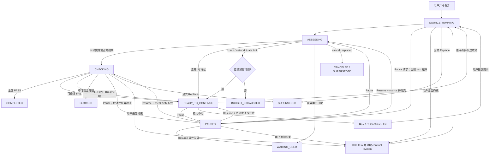

# 主 Agent 外部持续监督器设计

状态：提案，尚未实现。

本文设计一个运行在主 Agent 之外的任务级监督器。它不替代 Codex `/goal`，也不要求用户输入新命令；启用策略后，监督器从用户发起的主 Agent 任务开始，持续检查需求完成度、代码质量和可恢复异常，并在安全边界内驱动主 Agent 继续工作，直到达到可审计的完成条件，或进入明确的停止状态。

## 1. 问题与结论

当前插件以一次主 Agent turn 为边界：turn 结束后运行 verifier/reviewer，失败时最多发送若干轮修复提示；另有 outcome chain 处理等待用户和部分异常。它能够回答“这一轮是否通过”，但不能可靠回答“用户的整个任务是否已经完成”。原因包括：

- review、verify、fix、answer 和 retry 分属不同的短生命周期流程，没有统一的任务状态；
- 每轮只保存局部基线，无法把用户原始需求、所有修复轮次和累计证据绑定在一起；
- 多个流程都可能向主 Agent 发送消息，难以证明不会重复发送或互相覆盖；
- 插件重启、用户插话、无进展循环和发送竞争没有共同的恢复协议；
- “完美完成”没有可判定边界，若直接实现为“继续到满意”为止，会产生无限循环。

因此，新能力应是一个独立的深模块 `CompletionSupervisor`：对外只有事件输入和生命周期控制，对内统一拥有任务状态、检查调度、继续决策、预算、持久化和所有自动发送。现有 Gate 能力作为其内部机制逐步迁入，而不是继续扩张若干彼此独立的 chain。

## 2. 目标与非目标

### 2.1 目标

- 以一次用户任务为持续监督边界，而不是以一次 turn 为边界。
- 主 Agent 认为自己完成后，独立验证需求完成度与代码质量。
- 主 Agent 因可恢复异常、遗漏或检查失败而停止时，生成有证据的继续提示；仅在宿主支持原子条件发送时自动派发。
- 用户随时拥有最高控制权；用户输入、取消和需要真实决策的场景不会被自动化越权。
- 所有自动副作用均可追踪、幂等、可在插件重启后恢复。
- 用预算与进展检测保证监督有界，避免“永不停止”或重复消耗。
- 在主时间线上用一张稳定更新的任务卡解释当前阶段、证据和停止原因。

### 2.2 非目标

- 不实现或覆盖任何宿主原生命令，包括 Codex `/goal`。
- 不承诺主观意义上的“绝对完美”；只承诺满足明确的完成契约。
- 不把模型评审当作安全边界或形式化证明。
- 不自动回答产品取舍、凭据、权限、付款、发布等必须由用户决定的事项。
- 第一阶段不在 context/quota 耗尽后创建替代主 Agent；这需要独立的上下文交接设计。
- 不允许 verifier/reviewer 修改工作区，也不自动回滚它们造成的修改。
- 不以普通 `send()` 的“先检查、后发送”模拟原子条件发送；宿主能力不足时退化为人工派发。

## 3. 领域模型

| 术语 | 定义 |
| --- | --- |
| Task | 从一条真实用户请求开始，由其主 Agent 工作轮、监督器继续轮和检查轮组成的持久任务。 |
| Source Agent | 承担用户任务的主 Agent。监督器不会把检查 Agent 误认为 Source Agent。 |
| Attempt | Source Agent 的一次 turn；来源为 `user`、`continue`、`fix` 或 `retry`。 |
| Check | 对当前任务快照执行的一次 verifier 或 reviewer 检查。 |
| Completion Contract | 判定任务可以结束所必须同时满足的、可审计的条件。 |
| Human Boundary | 需要用户选择、授权或提供外部信息，监督器不得代答的边界。 |
| Progress Fingerprint | 用于判断连续轮次是否真正取得进展的稳定摘要。 |
| Planned Action | 已持久化、尚未确认完成的一次发送、建检查 Agent、更新卡片或归档操作。 |
| Requirement Revision | 原始请求及所有后续用户约束组成的、单调递增的完成契约版本。 |
| Workspace Lease | 以规范化工作区为键，串行保护 Source Agent 自动工作和所有 evaluator 的持久租约。 |

一个 Source Agent 同一时刻最多有一个 active Task。任何非终态 Task 收到真实用户输入时，安全默认值都是把输入追加为该 Task 的新 Requirement Revision：保留原始请求、初始基线、已解决及未解决项，同时使旧检查结果失效。`WAITING_USER` 下的输入同时作为待决问题的回答。只有宿主提供明确的 replace 原因，或用户点击 `Replace task`，才把旧 Task 标记为 `SUPERSEDED` 并创建新 Task。该关联由事件类型和显式控制决定，不依靠模型猜测文本意图。

追加约束必须在收到该用户 turn 的首个 lifecycle event 时以单个事务完成，并先于该 turn 的任何其他监督器处理：追加原文及事件 id、递增 contract revision、废弃尚未派发的自动 action，并把正在运行或已完成的旧 revision checks 标为 stale。新 attempt 仍属于原 Task，并以累计 Completion Contract 为验收依据。

## 4. “完成”的可执行定义

监督器只在下列条件同时成立时标记 `COMPLETED`：

1. **需求验证通过**：verifier 根据最新 Requirement Revision 中的原始用户请求、全部后续约束、仓库状态和执行证据返回 `PASS`。
2. **质量门通过**：reviewer 没有达到策略阻断级别的发现；默认 `HIGH` 与 `CRITICAL` 阻断。
3. **证据充分**：适用的构建、类型检查和测试已执行，或 verifier 明确说明为何不适用。仅凭主 Agent 自述不能完成。
4. **无待处理人类边界**：没有未回答的问题、权限请求或外部决策。
5. **状态一致**：检查针对的树快照仍是当前快照，且检查 Agent 未修改工作区。

`INCONCLUSIVE` 不是通过。若能通过补充检查、读取仓库或让主 Agent 继续工作来消除不确定性，则继续；否则进入 `WAITING_USER` 或 `BLOCKED`。

这一契约把“直到完美”收敛为“直到全部可配置门禁通过”。策略可以提高标准，但不能取消预算和人类边界。

## 5. 核心不变量

1. 每个 Source Agent 至多一个 active Task。
2. 每个 Task 至多一个影响 Source Agent 的 Planned Action 正在执行。
3. 只有 `CompletionSupervisor` 可以向 Source Agent 自动发送消息；检查模块只能返回结果。
4. 用户事件优先于自动事件。收到新用户输入后，旧 contract revision 不得再派发 continue/fix/retry。
5. 先持久化状态与 action id，再执行外部副作用；重启后通过相同 id 对账。
6. 每个 verdict 必须绑定 task、cycle、策略快照和 git 树快照；过期 verdict 不参与完成判定。
7. 终态卡片必须在检查子 Agent 归档前发布，避免 UI 永久停留在 Running。
8. 任何 evaluator 工作区修改都会使其 verdict 失效，并令任务进入 `WAITING_USER`；监督器不擅自回滚，必须等待用户决定如何处理变更。
9. 达到时间、轮次、重试或无进展预算时必须停止自动发送。
10. 同一规范化工作区内，插件派发的 Source Agent attempt 与 evaluator check 必须共同持有唯一 Workspace Lease，不得并行。
11. 无人值守 continue/fix/retry 只能通过宿主提供的原子 `sendIfIdle(expectedRevision)` 派发；没有该能力时禁止自动调用 `send()`。
12. 非终态 Task 上的用户追加输入必须继承原始请求、初始基线、Completion Contract 和未解决项；只有显式 replace 可以切换 Task。
13. evaluator 必须运行在绑定被检快照的隔离 worktree 中；若无法创建或指定隔离目录，task 模式不得启动检查。

## 6. 模块边界

`CompletionSupervisor` 是面向插件入口的深模块。它接受依赖，返回结果；Paseo 生命周期 hook、RPC 和启动恢复都通过同一事件接口进入，不让调用者拼装内部工作流。

```ts
type SupervisorEvent =
  | { type: "turn_started"; event: TurnStartedEvent }
  | { type: "turn_ended"; event: TurnEndedEvent }
  | { type: "permission"; event: PermissionRequestedEvent }
  | { type: "control"; taskId: string; action: "pause" | "resume" | "stop" | "replace" }
  | { type: "reconcile" };

interface CompletionSupervisor {
  accept(event: SupervisorEvent, paseo: Paseo): void;
  idle(): Promise<void>;
  close(): Promise<void>;
}
```

`accept` 只负责排队，避免阻塞 Paseo hook。事件先按规范化 workspace key 路由到串行队列，再在队列内按 Task 处理。只有不同工作区可以并行；指向同一工作区的不同 Source Agent 也必须竞争同一 Workspace Lease。检查子 Agent 的事件根据持久化 owner 映射路由回相同工作区队列。

内部实现建议分为以下模块：

```text
index.server.ts
    │ lifecycle event / RPC
    ▼
CompletionSupervisor ───────────────► TimelinePresenter
    │ owns state and all sends              │ one stable card
    ├── OutcomeClassifier
    ├── DecisionEngine
    ├── CheckRunner ────────────────► verifier / reviewer agents
    ├── PromptBuilder
    ├── WorkspaceLeaseManager
    └── SupervisorStore ────────────► SQLite
                 │
                 └──────────────────► Planned Action outbox
```

- `DecisionEngine` 是纯函数：输入任务快照、outcome、check 结果和预算，输出下一状态与 action，不执行副作用。
- `SupervisorStore` 是持久化 seam；生产使用 SQLite，测试可使用内存 adapter。
- `AgentRuntime` 封装 Paseo 的 refresh/send/create/archive/timeline/permission 操作。它同时有生产与测试 adapter，因此值得成为 port。
- `CheckRunner` 只能为固定快照创建隔离 worktree、创建和归档 evaluator、收集 verdict；它不能向 Source Agent 发送消息。
- `PromptBuilder` 从任务证据生成 continue/fix/retry 提示，禁止自由读取隐式全局状态。
- `TimelinePresenter` 使用稳定 card id 更新同一张任务卡，而不是每轮留下一个无法关联的卡片。
- `WorkspaceLeaseManager` 规范化工作区身份，并用持久 lease 串行化该工作区的自动 source attempt 与所有 checks。

测试从 `CompletionSupervisor` 公共接口进入。私有状态函数只在复杂纯逻辑确有必要时单测，避免测试与实现细节绑定。

## 7. 状态机

### 7.1 状态

| 状态 | 含义 |
| --- | --- |
| `SOURCE_RUNNING` | Source Agent 正在执行用户或监督器派发的 attempt。 |
| `ASSESSING` | 分类 Source Agent 的结束原因并确定下一步。 |
| `CHECKING` | 持有 Workspace Lease，在绑定同一快照的隔离 worktree 中串行执行 completion/quality checks。 |
| `READY_TO_CONTINUE` | 已生成继续动作；原子条件发送可用时等待自动派发，否则等待用户人工派发。 |
| `WAITING_USER` | 需要真实用户输入，暂停所有自动化。 |
| `PAUSED` | 用户主动暂停，或一个无需补充业务信息的可恢复操作条件暂时不满足；禁止自动副作用。 |
| `COMPLETED` | 完成契约全部通过。 |
| `BLOCKED` | 当前 Task 无法安全恢复的永久失败。它是终态，只能创建继承契约的新 Task，不能 Resume。 |
| `BUDGET_EXHAUSTED` | 时间、轮次、重试或无进展预算耗尽。 |
| `CANCELED` | 用户取消了当前工作。 |
| `SUPERSEDED` | 用户新任务替代了当前任务。 |
| `ERROR` | 插件内部不可恢复错误。 |

`COMPLETED`、`BLOCKED`、`BUDGET_EXHAUSTED`、`CANCELED`、`SUPERSEDED`、`ERROR` 为终态，任何 control 都不能使它们重新发送。`WAITING_USER` 只能由下一条真实用户输入恢复同一个 Task。`PAUSED` 只能由显式 `resume` control 恢复；普通用户消息仍按 Requirement Revision 规则追加到 Task，并作为新的用户 attempt 进入 `SOURCE_RUNNING`。

`pause` 可以在 `SOURCE_RUNNING`、`ASSESSING`、`CHECKING` 或 `READY_TO_CONTINUE` 请求。若 Source Agent 已在运行，不取消该 turn，只禁止后续自动动作，并在 turn 结束后进入 `PAUSED`；若 evaluator 在运行，则取消 evaluator、将 cycle 标为 stale，再进入 `PAUSED`。进入 `PAUSED` 前必须释放 Workspace Lease，并保证没有 `executing` action；未确认 action 只保留为恢复线索，不能直接重放。

`resume` 仅在以下条件全部成立时接受：Task 当前为 `PAUSED`；没有更新的 replace/cancel；最新 contract revision 仍可读取；工作区 lease 未被其他 Task 占用；恢复不会立即越过任何 attempt/retry/no-progress 预算。恢复事务先废弃 pause 前未确认的 source/check actions，再由 `DecisionEngine` 根据持久事实选择唯一目标：有效的待派发 continue/fix/retry 进入 `READY_TO_CONTINUE`；最新 source attempt 尚未分类则进入 `ASSESSING`；快照与 contract revision 仍匹配的未完成检查进入 `CHECKING`。若上述事实不再成立，则进入 `WAITING_USER` 或一个终态，不能猜测恢复。

暂停和恢复不重置 attempt、fix、retry、check retry 或 no-progress 计数。`max_minutes` 只累计非 `PAUSED` 时间，使用持久化的 `paused_at` 与 `accumulated_pause_ms` 计算；恢复时若其他预算已经耗尽，原子转为 `BUDGET_EXHAUSTED`，不派发动作。

### 7.2 主流程



每次从 `CHECKING` 返回继续工作都会创建新 cycle。旧 cycle 的结果仍保留用于审计，但不会跨快照复用。

## 8. 决策规则

| Source outcome | 默认动作 | 说明 |
| --- | --- | --- |
| `done` | 运行 completion + quality checks | 即使工作区未变化也要验证；纯分析任务可能无需代码变更。 |
| `incomplete` | 生成带缺口证据的 continue 提示 | 自动派发要求原子条件发送，否则由用户提交；计入 source-turn 与 no-progress 预算。 |
| `awaiting_user` | 能从仓库确定的事实可由 assessor 给出；真实选择进入 `WAITING_USER` | 不把“继续”伪装成用户决定。 |
| `refused` | 默认 `BLOCKED` | 若策略明确声明为可恢复的技术性拒绝，应直接进入 `READY_TO_CONTINUE`，不能先进入 `BLOCKED` 再 Resume。 |
| `crashed` / `network` / `rate_limited` | 指数退避后 bounded retry | 自动 retry 同样要求原子条件发送；使用同一 Task 和确定性 message id。 |
| `quota_exhausted` / `context_exhausted` | `BLOCKED` | 同一 Agent 无法可靠恢复；未来可接入 successor handoff。 |
| `user_canceled` | `CANCELED` | 不发送任何自动消息。 |
| `replaced` | `SUPERSEDED` | 只接受宿主明确原因或用户显式 `Replace task`。 |
| 未知错误 | `ERROR` | 保留诊断信息，不猜测重试。 |

检查结果规则：

- verifier `FAIL`：fix prompt 只包含未满足需求、证据和验收方式。
- reviewer 存在阻断级 findings：fix prompt 包含稳定 finding id，后续 cycle 必须逐项验证是否消失。
- reviewer 只有非阻断 findings：记录在完成卡片，但不强迫循环。
- verdict JSON 无效：允许在 check retry 预算内重跑 evaluator；不能因此让 Source Agent 重做任务。
- evaluator 修改树：使整个 cycle 失效并进入 `WAITING_USER`，由用户决定如何处理意外变更。

## 9. 进展检测与预算

每个 attempt 完成后计算：

```text
progressFingerprint = hash(
  gitTreeSha,
  normalizedOutcome,
  unresolvedRequirementIds,
  unresolvedBlockingFindingIds,
  relevantCommandEvidence
)
```

以下任一变化可视为进展：git tree 改变；未满足需求减少；阻断 finding 被解决；新产生了此前缺失的有效测试/构建证据。仅改写总结文字不算进展。

建议默认预算：

| 预算 | 默认值 |
| --- | ---: |
| Source Agent 总 attempt | 12 |
| fix attempt | 6 |
| 可恢复异常 retry | 3 |
| evaluator 无效输出 retry / check | 2 |
| 连续无进展 attempt | 2 |
| 墙钟时间 | 120 分钟 |

任一预算耗尽即进入 `BUDGET_EXHAUSTED`，卡片显示最后缺口、最近证据和推荐的人工下一步。预算是硬上限，策略只能配置为其他有限正整数。

## 10. 持久化模型

不要继续把任务级状态塞入现有 `gate_runs` 或 `chains`。新增任务、需求事件、attempt、check、workspace lease 表和一个 action outbox：

### `supervisor_tasks`

- `task_id`、`source_agent_id`、`workspace_id`、`workspace_key`、`repo_root`
- `status`、`phase`、`cycle`
- `initial_request`、`contract_revision`、`policy_snapshot_json`、`completion_contract_json`
- `base_tree`、`current_tree`、`progress_fingerprint`
- `source_attempts`、`fix_attempts`、`retry_count`、`no_progress_count`
- `started_at`、`updated_at`、`deadline_at`、`paused_at`、`accumulated_pause_ms`
- `pause_reason_json`、`resume_target_hint`
- `last_error`、`terminal_reason_json`

通过约束或事务保证一个 `source_agent_id` 最多一条非终态记录。

### `supervisor_requirements`

- `(task_id, revision)` 主键
- `event_id`、`kind = initial | constraint | answer`
- `content`、`received_at`
- `inherited_base_tree`、`unresolved_items_json`

该表只追加不改写。创建新 revision 与废弃旧 revision 的 actions/checks 必须在同一个事务内完成，确保任何恢复点都不会只看到追加约束而仍使用旧契约。

### `supervisor_attempts`

- `(task_id, sequence)` 主键
- `turn_key`、`message_id`、`origin = user | user_update | continue | fix | retry`
- `start_tree`、`end_tree`、`outcome`
- `reply_hash`、`evidence_json`、`started_at`、`ended_at`

### `supervisor_checks`

- `(task_id, cycle, check_name, attempt)` 主键
- `child_agent_id`、`snapshot_id`、`tree_sha`、`contract_revision`、`isolation_path`、`status`、`verdict`
- `result_json`、`dispatch_json`、`started_at`、`ended_at`

### `supervisor_workspace_leases`

- `workspace_key` 主键
- `owner_task_id`、`owner_action_id`、`kind = source | check`
- `generation`、`acquired_at`、`expires_at`、`heartbeat_at`

`workspace_key` 由工作目录 realpath、git common dir 与实际 worktree identity 共同计算：同一路径共享 lease，独立 git worktree 可独立调度。lease 过期不能直接被抢占；必须先核对 owner Agent 已终止且工作区 fingerprint 稳定。

### `supervisor_actions`

- `action_id`、`task_id`、`kind`、`payload_json`
- `status = planned | executing | confirmed | abandoned`
- `attempts`、`not_before`、`last_error`、时间戳

action id 必须确定性生成，例如：

```text
pts:<task-id>:source:<attempt>
pts:<task-id>:check:<cycle>:<check-name>:<attempt>
pts:<task-id>:card
```

## 11. 副作用、并发与幂等

一次自动动作遵循固定协议：

1. 在同一 SQLite 事务中推进状态并写入 `planned` action。
2. 获取对应 Workspace Lease；确认同工作区没有插件派发的 source/check 正在运行。
3. 刷新 Source Agent；确认 Task、contract revision 与工作区 fingerprint 仍匹配。
4. 通过满足该动作安全条件的宿主原语执行副作用。
5. 用可观察事实确认结果，再把 action 标记 `confirmed`。
6. 若进程在任意步骤崩溃，`reconcile` 根据 action id、lease generation 和 Agent 时间线决定确认、重试或放弃。

### 11.1 Source Agent 条件发送

无人值守 task 模式的发布前置条件是 `AgentRuntime` 明确报告并实现原子条件发送。建议的宿主语义为：

```ts
send({
  message,
  messageId,
  ifAgentIdle: true,
  expectedTimelineRevision,
});
```

宿主必须在一个不可分割的操作中验证 Agent idle 且 timeline revision 未变化；条件不满足时不得取消、替换或修改任何 turn，并返回可区分的 conflict 结果。只有该原语成功后 action 才能进入 `executing`/`confirmed`。

当前 Paseo 普通 `send()` 会取消运行中的 turn，且不具备上述原子条件，因此不能用于无人值守 continue/fix/retry。运行时缺少该 capability 时，Task 自动进入 **assisted dispatch**：监督器继续生成检查结果和提示词，但卡片只提供 `Prepare Continue` / `Prepare Fix`，用于复制或预填到用户输入框；由用户检查并亲自提交。插件不得在 assisted dispatch 中调用 Source Agent 的 `send()`。这不是临时的 check-then-send 降级路径，而是必须测试的不发送保证。

### 11.2 共享工作区调度

Workspace Lease 覆盖同一工作区内所有插件派发的 source attempts、verifier 和 reviewer；同一 Task 的 checks 也严格串行。每个 evaluator 还必须在由 `snapshot_id` 构造的临时隔离 worktree 中运行，不能把构建产物、测试写入或意外编辑带回 Source Agent 工作目录。隔离 worktree 虽有临时路径，调度时仍继承 Source Task 的 `workspace_key` 和 lease。调度前必须同时满足：

- lease 可安全获取；
- 已知的同工作区 Source Agent 均不在运行；
- 当前 fingerprint、Task 和 contract revision 与 planned action 一致。
- 固定快照已完整包含本次任务需要验证的 tracked 与 untracked 内容，且 evaluator cwd 可绑定到隔离 worktree。

用户直接启动的 turn 不受插件 lease 阻塞。若这类 turn 在 check 或自动 source attempt 期间出现，监督器立即把 lease 标为 contended，停止派发新动作，并尽力取消 evaluator；即使隔离 worktree 防止了文件互扰，该 cycle 的所有 verdict 仍无条件 stale。待所有已知同工作区 Source Agent idle 后重新读取 fingerprint：若变更无法归属到唯一 Task，相关 Task 进入 `WAITING_USER` 并请求用户选择归属，不自动合并或完成。

如果 Paseo 无法列举同工作区运行中的 Agent，插件不能证明 lease 排他性；如果不能为 evaluator 指定隔离 cwd，插件也不能证明检查不会污染 Source Agent。任一能力缺失时，task 模式只能使用 assisted dispatch 且不得启动 evaluator，卡片应解释缺失能力。用户本来就在独立 git worktree 中启动的 Task 具有不同 worktree identity，可各自持有 lease 并行；监督器为 evaluator 创建的临时 worktree 则始终继承 Source Task 的 lease，不增加并发度。

## 12. 崩溃恢复

`reconcile` 执行以下步骤：

1. 查询所有非终态 Task 和未确认 action。
2. 刷新 Source Agent 与仍存在的 evaluator。
3. 以时间线中的 message id、child id 和卡片 id 对账，禁止盲目重复副作用。
4. 结束已终止但未落库的 attempt/check。
5. 重新排队已到期且仍安全的 retry/continue。
6. 对可恢复的临时运行时不可用进入 `PAUSED`；对已确认不可恢复的 Agent 丢失或持久状态损坏进入 `BLOCKED`/`ERROR` 并发布终态卡片。

当前插件在 daemon 重启后，只有收到第一个 hook 或 RPC 才能取得 Paseo SDK handle；因此无法在完全无事件时主动 reconcile。这是宿主接口限制。实现阶段应先在取得 handle 后立即恢复；同时向 Paseo 提议在 `createServerPlugin(context)` 中提供 SDK 或 ready hook。

## 13. 用户交互

主时间线只保留一张稳定更新的 Supervisor 卡片，至少显示：

- 当前状态与阶段；
- 原始任务摘要；
- attempt、fix、retry、无进展和时间预算；
- 当前 git 快照；
- verifier/reviewer 最新结论及阻断项；
- 最近一次自动动作和下一步；
- 终止原因和可复制的诊断命令。

卡片提供：

- `Pause supervision`：停止派发后续自动动作；当前 Source Agent turn 自然结束，运行中的 evaluator 被取消并作废；
- `Stop supervision`：立即转为 `CANCELED`，不终止正在运行的用户主 turn，但禁止后续自动动作；
- `Resume`：仅在 `PAUSED` 可用；保留全部计数并重新验证契约、快照、lease 和预算后，由 `DecisionEngine` 选择恢复目标；
- `Prepare Continue` / `Prepare Fix`：assisted dispatch 下只复制或预填提示词，不调用 Agent `send()`；
- `Replace task`：显式结束当前 Task，下一条用户输入从新契约开始；
- `Continue once`：宿主支持原子条件发送时可选的人工单步，不提高任何预算上限。

卡片必须显示 `dispatch: autonomous` 或 `dispatch: assisted`，以及进入 assisted 的缺失 capability。用户不应从“Running”误以为普通 `send()` 正在后台等待机会。

这不是 slash command：用户无须学习额外命令，卡片只是透明度和紧急制动界面。

发布顺序必须是：持久化终态 → 更新 Source Agent 卡片 → 归档 evaluator。卡片更新失败时保留可重试 action，不因 child 已停止而显示永久 Running。

## 14. 权限与信任边界

- supervisor、verifier 和 reviewer 的提示词来自项目初始化的规则文件，不依赖通用 Paseo profile。
- 自动批准只适用于 evaluator 的只读、例行请求；不确定或有风险的权限必须转交用户。
- Source Agent 的权限仍由宿主管理，监督器不能代替用户批准危险操作。
- 仓库内策略和提示词属于可信项目配置，但不是抵御恶意仓库内容的安全沙箱。
- evaluator 被明确要求只读；任何树变化都使结果失效。插件只报告变化，不执行破坏性回滚。
- 任务记录可能包含用户需求和评审摘要，应遵循现有本地 SQLite 数据保留策略，不额外上传。

## 15. 策略草案与兼容性

建议在下一版 schema 中引入一个任务级块，保留现有 agents 和 trigger 语义：

```json
{
  "version": 3,
  "supervision": {
    "mode": "task",
    "dispatch": "auto",
    "checks": ["verify", "review"],
    "blocking_severity": "HIGH",
    "budget": {
      "max_source_attempts": 12,
      "max_fix_attempts": 6,
      "max_retries": 3,
      "max_check_retries": 2,
      "max_no_progress_attempts": 2,
      "max_minutes": 120
    }
  }
}
```

推荐迁移策略：

- `mode: "turn"` 保留现有 v2 行为；v2 文件按此解释，不静默启用任务级自动化。
- 新初始化可明确询问并推荐 `mode: "task"`，同时生成项目定制的 verifier/reviewer 规则。
- `dispatch: "auto"` 表示请求无人值守派发，但只有 runtime capability probe 通过才可生效；否则明确降级为 assisted。也可显式配置 `"assisted"`。
- v2 `on_fail` 映射为 task 模式的 fix budget，`on_outcome` 映射为异常处理预算；解析时若语义冲突应报错，不能猜测。
- 升级期间，已有 v2 chain 允许按旧实现结束；v3 只接管升级后新创建的 Task，避免双重发送。
- 插件版本与远程 initializer revision 必须一致，防止旧插件读取新 schema。

## 16. 测试策略

### 决策与不变量测试

- 对每种 outcome、verdict、预算边界建立决策表测试。
- 属性测试验证一个 Source Agent 不会存在两个 active Task、终态不会再次发送、过期 verdict 永不通过。
- progress fingerprint 对等价文本稳定，对真实证据变化敏感。

### 状态机集成测试

使用真实临时 git 仓库和 SQLite，以及 fake `AgentRuntime`，从公共 `CompletionSupervisor.accept()` 驱动：

- done → checks pass → completed；
- review fail → fix → recheck → completed；
- incomplete → continue，连续无进展后停止；
- crash/network/rate limit 按预算退避重试；
- context/quota 直接 blocked；
- pause 不取消运行中的 Source Agent turn，进入 `PAUSED` 后不会自动发送；
- resume 只接受 `PAUSED`，并分别覆盖恢复到 `READY_TO_CONTINUE`、`ASSESSING`、`CHECKING` 及条件失效的路径；
- resume 不重置计数，暂停时间不计入 `max_minutes`，其他预算已耗尽时直接 `BUDGET_EXHAUSTED`；
- `BLOCKED` 上的 resume 被拒绝，且终态不会产生任何新 source/check action；
- 原子 continue 与用户输入竞争时，条件失败且用户 turn 不被取消；
- 缺少原子发送 capability 时，任何路径都不会调用 Source Agent `send()`；
- 执行中和检查中追加约束时，原 Task 的请求、基线和未解决项被继承，旧 checks/actions 失效；
- 只有显式 replace 才创建不继承契约的新 Task；
- 同工作区两个 Source Agent 的自动 source/check 动作严格串行；用户 turn 造成 lease contention 时 cycle 失效；
- evaluator 只能在绑定固定 snapshot 的隔离 worktree 运行，不能污染 Source Agent 目录；
- 独立 worktree 的任务可以并行；
- reviewer 先结束、终态卡发布、再归档；
- evaluator 修改工作区导致 verdict 失效；
- 每个“持久化前/后、外部调用前/后”崩溃切点恢复后无重复消息和孤儿卡片。

### Provider smoke test

至少覆盖 Codex 和一个其他 Paseo adapter，验证：

- 任务无需 slash command 自动开始；
- Source Agent、检查 Agent 与卡片的身份关联正确；
- 真实权限请求不会被错误自动批准；
- daemon reload 后能在下一次可用 SDK 事件时恢复；
- 终态与 `paseo logs` 中的事实一致。

## 17. 验收标准

实现可发布前必须证明：

1. 一个包含两次修复的任务始终只显示一张任务卡，并最终给出绑定当前 tree 的 PASS 证据。
2. 宿主提供原子条件发送时，主 Agent 提前停止或报告可恢复异常后，监督器能在预算内继续而无需用户发送聊天消息；宿主不提供时只生成供用户提交的提示。
3. 原子发送与用户输入竞争时，用户 turn 不会被取消或替换；capability 缺失时不存在后台普通 `send()`。
4. 用户在执行中或检查中追加约束后，Task 保留原始请求、初始基线和未解决项，并只接受最新 contract revision 的检查结果。
5. 同一工作区的自动 source/check 流程不会并行，外部用户 turn 造成的污染不会产生有效 verdict。
6. `PAUSED` 不执行自动副作用；合法 Resume 保留所有计数并根据当前事实进入唯一恢复目标，`BLOCKED` 永远不可 Resume。
7. daemon 在每个关键副作用边界崩溃并恢复，不会重复发送或永久显示 Running。
8. 连续两轮无实际进展后自动停止并说明未完成项。
9. context/quota 耗尽、真实用户决策和危险权限不会被伪装成可恢复工作。
10. evaluator 修改工作区时任务不会被错误标为完成。
11. v2 策略继续按旧语义工作，且不会被 v3 initializer 产生的配置破坏。

## 18. 分阶段实施

1. **建立模块 seam**：引入 `CompletionSupervisor`、per-workspace 队列、store/runtime adapters；先保持 v2 外部行为不变。
2. **统一任务记录与卡片**：新增 task/requirement/check/lease/action 表，把 review/verify 生命周期和终态发布顺序迁入统一状态机。
3. **安全调度**：先实现 Workspace Lease、Requirement Revision 和 runtime capability probe；缺少原子条件发送时仅开放 assisted dispatch。
4. **持续执行**：宿主满足原子条件发送后，把 fix、answer 和 retry 合并为由 `DecisionEngine` 产生的 source actions，加入完成契约。
5. **有界自治**：实现进展 fingerprint、全套预算、用户 stop/resume 和 human boundary。
6. **恢复加固**：覆盖 crash cut-point、发送竞争和 daemon reload；推动 Paseo 增加 ready hook。
7. **v3 启用**：更新 initializer、迁移文档和 provider smoke test，明确 opt-in 到 task 模式。

每一阶段都应保持现有 v2 测试通过。迁移完成前，旧 Gate 和新 Supervisor 不能同时拥有 Source Agent 的发送权。

## 19. 被否决的替代方案

- **直接无限增加 fix rounds**：没有任务级完成定义、异常恢复和无进展检测，只会放大循环风险。
- **继续扩展现有 `chains` 表**：把 completion、quality、retry 和用户等待压入同一行会形成浅模块，调用方仍需理解多套状态机。
- **依赖 Codex `/goal`**：与用户期望不符，且把插件绑定到单一 provider；本设计只使用 Paseo 的 Agent 生命周期能力。
- **每轮独立卡片**：无法展示累计进展，且容易再次出现子 Agent 已结束而某轮卡片仍 Running 的分裂状态。
- **让 reviewer 直接修代码**：破坏独立验证，也使 verdict 与被验证快照不一致。
- **把所有错误都重试**：会掩盖权限、上下文、配额和真实用户决策等不可恢复边界。

## 20. 尚需验证的宿主能力

实现前应与 Paseo 明确以下接口：

- 能否提供原子的 `sendIfIdle(expectedRevision)`；
- server plugin 启动时能否立即获得 SDK/ready hook；
- 是否能稳定读取 timeline message id 以进行 outbox 对账；
- 是否能区分用户消息与插件自动消息，而不只依赖本地 message id；
- 是否有可靠的 Agent terminal/archived 事件，减少轮询；
- card action RPC 是否能在 daemon reload 后保持稳定路由。

原子 `sendIfIdle(expectedRevision)` 是无人值守派发的硬性发布条件，不具备时只能发布 assisted 模式。启动 SDK/ready hook 不阻止有人值守原型，但阻止“daemon 重启后无需任何新事件即可恢复”的保证。文档和 UI 必须如实暴露尚未获得的能力。
