# 工作流程（按场景）

下面每个场景都是一次真实会发生的对话：你对 agent 说了什么，插件在背后做了什么，时间线上出现什么卡片。实现细节见 [design.md](design.md) 和 [turn-outcomes.md](turn-outcomes.md)。

示例仓库的策略文件 `.paseo/post-turn-gate.json`（用 `npm run init` 生成全部默认值后改了这几项，下面只列出改过的）：

```json
{
  "version": 2,
  "on_fail": { "fix": { "max_rounds": 2 } },
  "on_outcome": {
    "awaiting_user": { "answer": { "max": 3 } },
    "network": { "retry": { "max": 2, "delay_seconds": 30 } }
  }
}
```

## 先看全貌：一轮结束后插件怎么决定

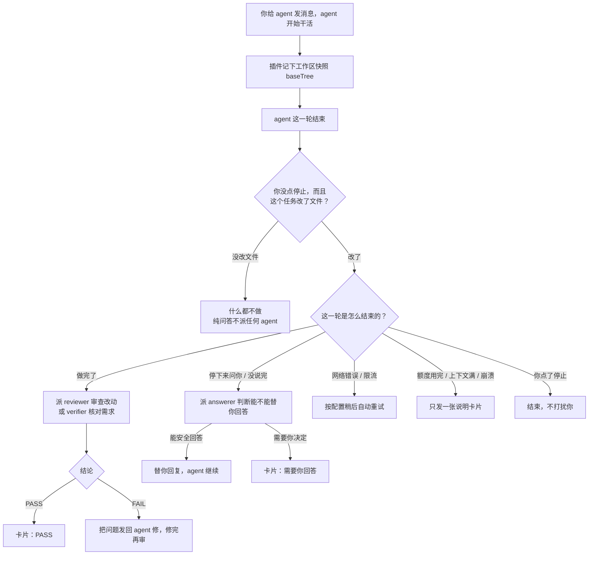

## 场景 1：改完代码，审查通过

你说："阅读代码，使用 mermaid 整理这个插件的工作流程。" agent 新建了 `docs/workflow.md`，并在 README 加了链接。

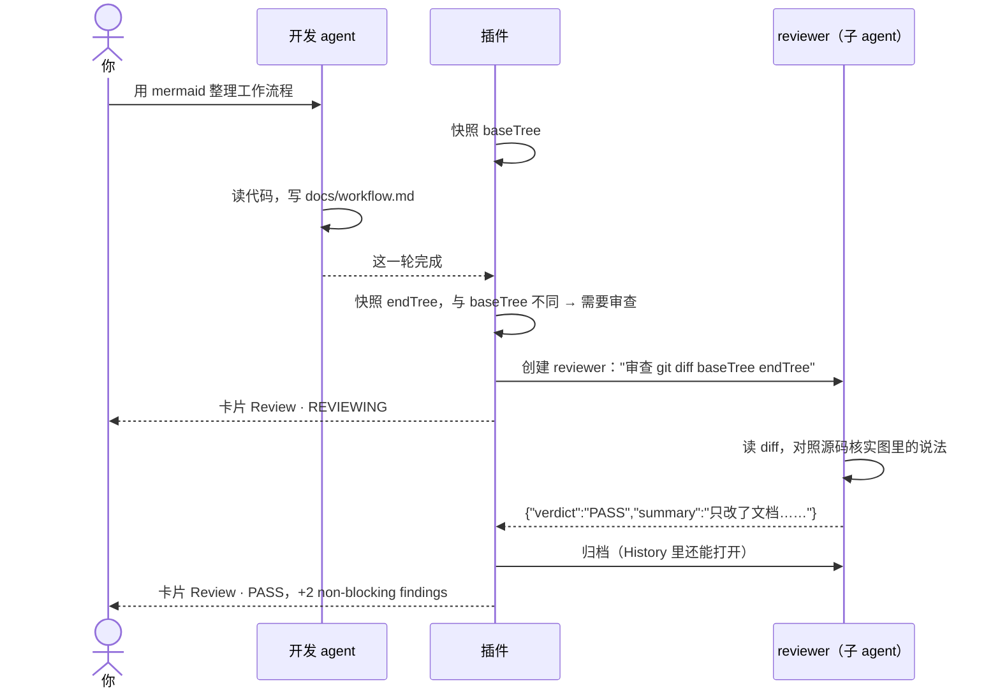

MEDIUM / LOW 级别的问题只显示为 "non-blocking findings"，不会拦住你。

## 场景 2：审查不通过，自动修复

你说："给 /users 接口加分页。" agent 加了 `limit` / `offset`，但没校验负数。

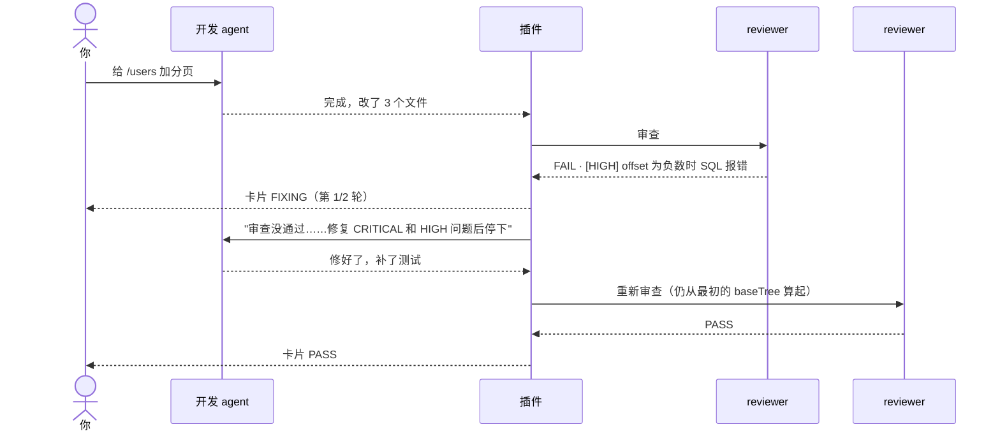

- 自动修复是默认行为（`max_rounds: 2`），目的是让 agent 自己循环到通过。设为 `"on_fail": "report"`（或 `npm run init -- --report`）时只出 FAILED 卡片，不发回去修。
- 修了 `max_rounds` 轮还是 FAIL，卡片变成 NEEDS_HUMAN，交给你处理。
- 修复期间你自己发了消息，这次审查标为 SUPERSEDED，以你的消息为准。

每个仓库的审查规则可以写在 `.paseo/post-turn-gate/reviewer.md` 里（`npm run init` 会生成带示例的模版，示例在 HTML 注释里，不会生效），和代码一起提交，例如"金额一律用整数分"、"新接口必须有集成测试"。reviewer 会把它当作额外规则。verifier、answerer 分别对应 `verifier.md`、`answerer.md`。

## 场景 2b：按需求逐项核对（verify）

你说："给 /users 加分页：支持 limit 和 offset，limit 最大 100，返回 total。" 这类请求是一张需求清单，比起代码风格，你更关心每一条是否都做到了。策略里写 `"on_outcome": { "done": ["verify"] }`（或 `npm run init -- --check verify`）。

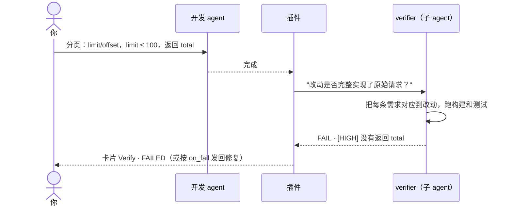

verifier 和 reviewer 的区别只在于问的问题：reviewer 问"代码对不对、好不好维护"，verifier 问"要的东西是不是都有了"。verifier 用 `agents.verifier` 的配置，默认 profile 是 `post-turn-gate-verifier`；这个 profile 还没建时继承开发 agent 的配置，卡片上会提示。

## 场景 2c：先核对需求，再审代码

同一个分页需求，你既想确认需求都做到了，也想让人看看代码质量。策略里写 `"on_outcome": { "done": ["verify", "review"] }`（或 `npm run init -- --check verify,review`），`on_fail` 保持默认的 `{ "fix": { "max_rounds": 2 } }`。

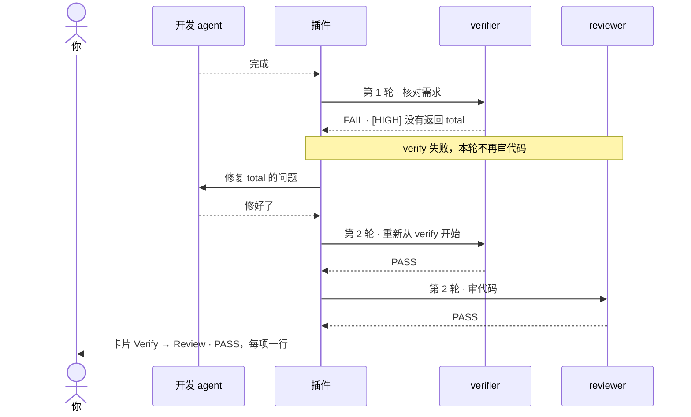

- 按列表顺序执行，第一个 FAIL 就停：需求没做到时审代码意义不大，修复时代码还会改。
- 修复后从第一项重新检查，因为修复可能破坏已经通过的检查。
- 两项都 PASS 才算 PASS；某项 INCONCLUSIVE 时后面照常检查，最终结果为 INCONCLUSIVE。
- 不并行执行：两个 agent 在同一个工作区里同时构建、测试会互相干扰。

## 场景 3：agent 问了一个仓库能回答的问题

你说："给 outcome.ts 补测试。" agent 回复："测试用 vitest 还是 node:test？" 然后停下了。

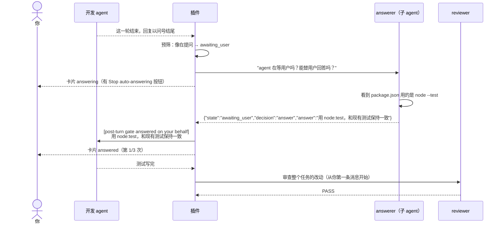

这几轮属于同一个任务（chain），所以审查的是整个任务的累计改动，不是最后一轮。

## 场景 4：问题必须由你决定

agent 问："旧的 users_v1 表要不要直接删掉？" 或者 "要我 push 到 origin 吗？"

```mermaid
sequenceDiagram
  actor 你
  participant A as 开发 agent
  participant G as 插件
  participant Q as answerer

  A-->>G: 停下来提问
  G->>Q: 能替用户回答吗？
  Q-->>G: decision = escalate（涉及删除数据）
  G-->>你: 卡片 needs_user："旧表要不要删？"
  你->>A: 先保留，加个迁移脚本
  G-->>你: 卡片改为 resolved："You replied; the task continues"
```

即使 answerer 给出了答案，插件也会再用关键词检查一遍（删除、push、部署、付费、密码等），命中就改为交给你。以下情况也会交给你：

- 同一个问题问了第二次；
- 自动回答次数达到 `max`；
- 你点了 Stop auto-answering；
- answerer 超过 `agents.answerer.timeout_minutes`（默认 10 分钟）没回复。

## 场景 5：agent 话没说完就停了

agent 执行完一条命令后这一轮就结束了，没有总结；或者 todo 列表还有没勾掉的项。

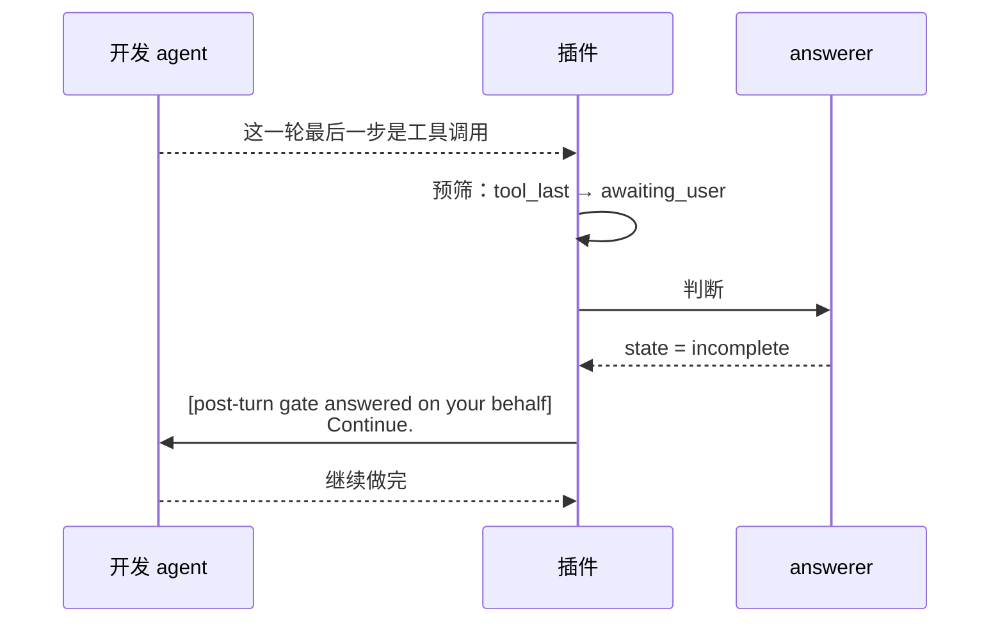

如果 answerer 判断其实已经做完（`done`），插件直接开始审查。

## 场景 6：网络断了，自动重试

agent 正在工作时报错 `ECONNRESET`。

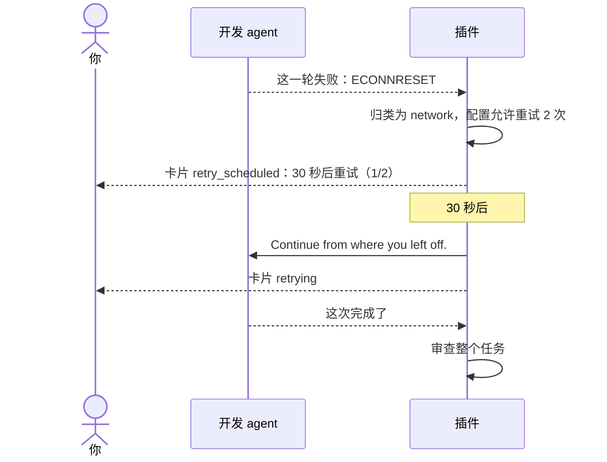

- 30 秒内你自己发了消息，自动重试就取消，卡片显示 "You replied first"。
- 重试次数用完后只发通知卡片。
- 额度用完（`quota_exhausted`）和上下文满（`context_exhausted`）不允许配置重试，因为重试也不会成功，只会出一张说明卡片告诉你怎么处理。

## 场景 7：reviewer 需要执行命令

reviewer 在审查时想运行 `npm test`，后来又想运行 `git push`。

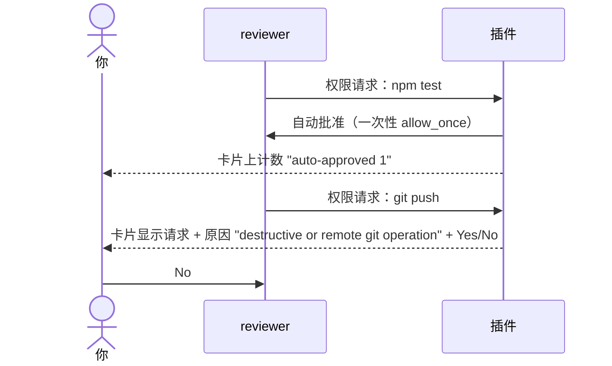

自动批准的范围：读文件、构建、测试、在仓库内编辑。以下请求一律交给你：`rm -rf`、`git push`、`sudo`、发布、云 / 部署工具、密钥文件、仓库外的路径。如果在 `agents.reviewer`（或 `verifier`、`answerer`）里设置 `"permissions": "ask"`，这个角色的每个请求都交给你。

## 场景 8：审查还没结束你就发了新消息

reviewer 正在审查，你又对 agent 说"顺便把日志也改一下"。

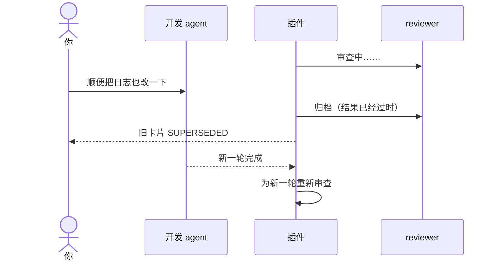

## 场景 9：插件或 daemon 重启

审查进行到一半时 Paseo 重启了。

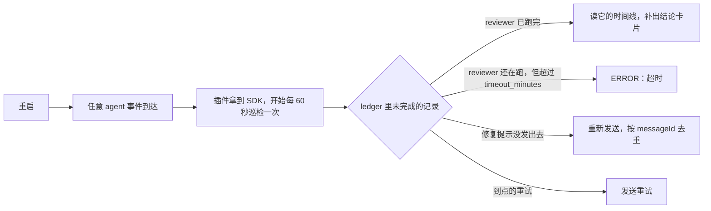

重启后要等到有 agent 事件进来，巡检才会开始。

## 什么时候插件不介入

| 情况 | 原因 |
|---|---|
| agent 没改文件，包括它最后问了你一句、或者网络出错 | 工作区快照没变。你就在对话里，不需要 answerer 或自动重试 |
| 仓库里没有 `.paseo/post-turn-gate.json` | 没启用 |
| 策略文件写错了 | 不审查，出一张配置错误卡片 |
| 普通子 agent 的轮次 | 默认只管根 agent；子 agent 需要带 `post-turn-gate.target=true` 标签 |
| reviewer / answerer 自己的轮次 | 插件不审查自己派出的 agent |
| 你点了停止 | `user_canceled`，默认忽略 |

## 卡片语言

reviewer 和 answerer 会用原始请求的语言写 summary、问题、回答和 findings，你用中文提问，卡片就是中文。想固定语言，在 `agents` 下对应角色的 `instructions` 里写明，例如 `"instructions": "Write all text in English."`。卡片标题、状态名，以及插件自己的提示语（例如 "You replied first"）目前固定为英文。
