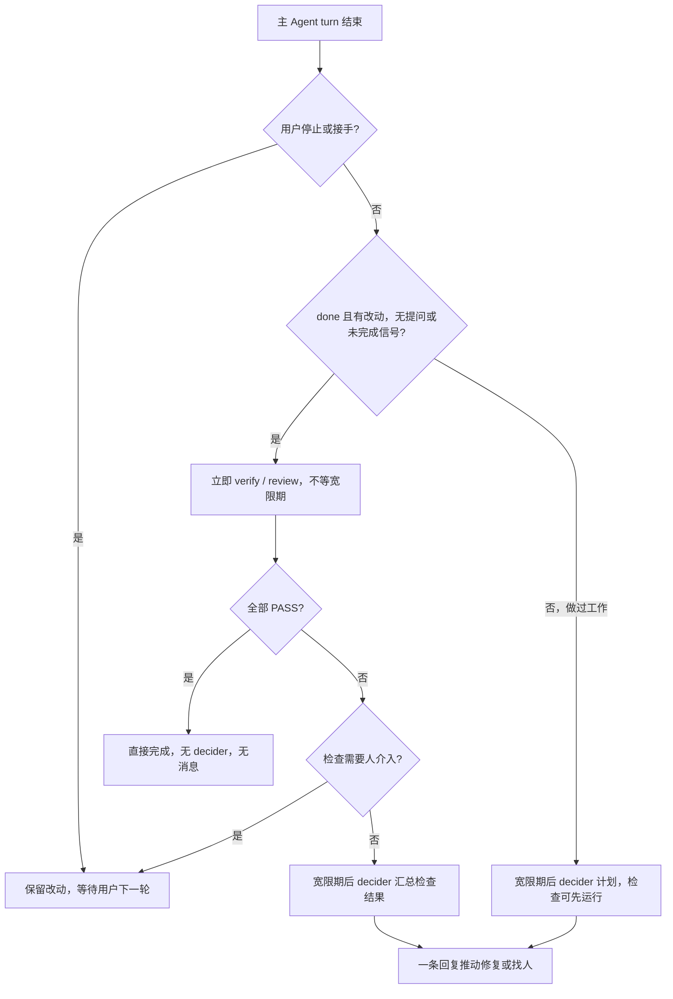
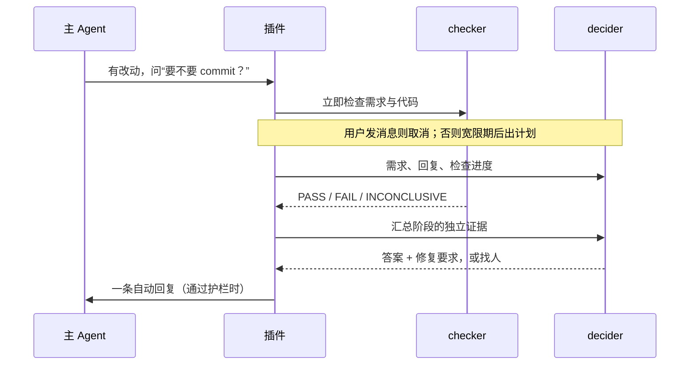

# 工作流程（当前 v3）

最小策略是 `{ "version": 3 }`：默认按 verify、review 串行检查，decider 有 60 秒宽限期，总自动消息最多 12 次。只支持 v3，没有模板修复或只报告模式。角色规则在 `.paseo/post-turn-gate/{verifier,reviewer,decider}.md`。

## 普通完成

完成捷径即使 `speculative_checks=false` 也立即检查。一个 FAIL 停止本次检查，其余检查不再启动；下一次源 Agent 改树后从第一项重新检查。INCONCLUSIVE 继续后续检查，最终交给 decider 补齐证据或找人。

## 做完一部分后提问

检查者不知道主 Agent 说了什么。decider 不能推翻 FAIL，也不能没有 PASS 就完成有改动的任务。模型可以把“保留当前接口”的答案与“修掉边界错误”的要求放在同一条消息中。

## 提前停止、失败与人类边界

未闭合代码块、tool-last 或未完成 todo 等信号进入 decider，通常回复“继续”；纯聊天不启动。crash、网络、限流按 30 秒、2 分钟、8 分钟重试，再交 decider；quota、context 耗尽直接找人。拒答、未知错误、缺测试、反驳先由 decider 判断。它只能坚持修改或把反驳交给用户，不能接受辩解生成 PASS。

产品取舍、外部动作、凭据、扩大范围、同题再问、预算耗尽由护栏或 decider 交给你。检查者无法给有效结论、改了工作区、权限不足或需求不明也交给你。未接受的改动一直在任务范围内。

## 用户接手与权限

你发消息会取消旧决策、归档角色并保留原始 baseline；下一轮检查整项任务。你停止主 Agent 时绝不启动 decider。停止插件发起的 turn 保留任务和 Stop/Resume 按钮；Stop auto-answering 会取消当前检查，直到 Resume 才恢复下一轮自动处理。

常规角色工具请求自动批准，高风险上卡。请求 5 分钟无人回答（默认）被拒绝；checker 获得一次机会给已有证据下的结论。`agents.<role>.permissions="ask"` 可让所有请求上卡。

## 多项目与恢复

每个 workspace 有自己的串行队列，慢创建不会堵住其他 workspace。基线在事件到达时拍摄，Git 调用最多 120 秒。共享同一仓库目录仍会混入其他 Agent 改动，重叠信息进入角色 prompt；独立 worktree 可避免。

重启后首个事件触发对账，之后每 60 秒一次；未创建成功的角色按同 id/key 重放，闲置角色从 timeline 恢复结果，超时转交用户。正在运行的源 turn 保留快照。源消息尚无原子派发或完整 outbox，详见 [design.md](design.md)。

每个决策轮一张卡片；检查、权限和 decider 的回复在同一张里。模型自由文本跟随请求语言；插件内置状态文字固定英文。
