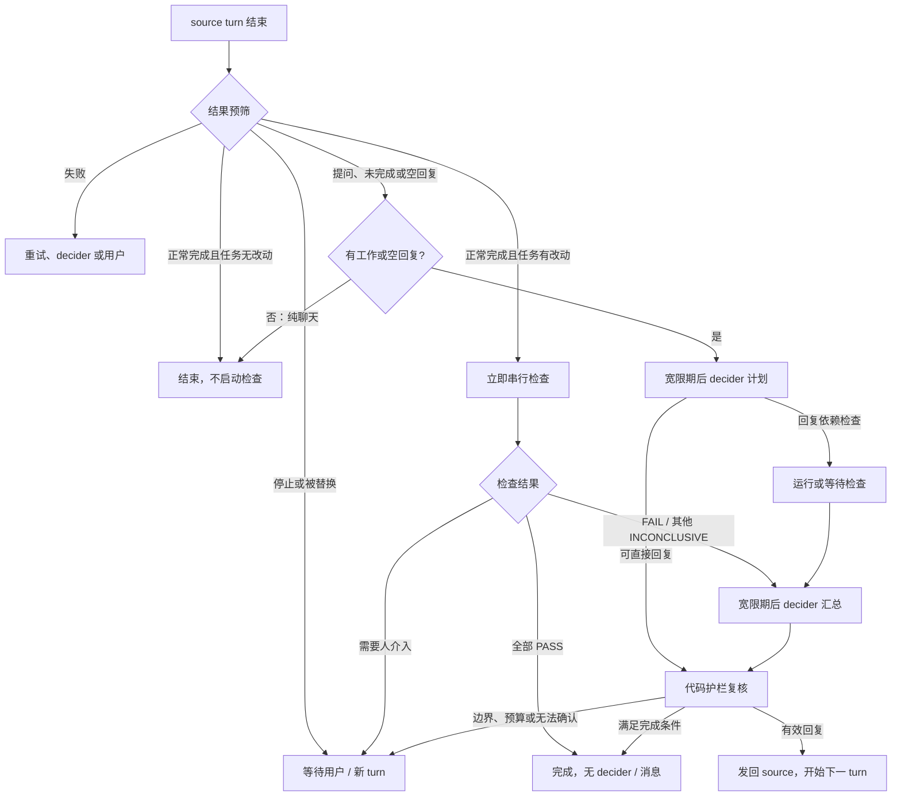

# v3 工作流程

[使用入口](../README.md) · [配置指南](configuration.md) · [实现原理](design.md)

## 三个角色与插件代码

| 角色 | 输入与职责 | 边界 |
| --- | --- | --- |
| source | 接收用户需求，在现有 Paseo 会话中编码 | 插件不替代它的 runtime |
| verifier | 只看需求和代码，将需求映射到可观察证据 | 不把 source 自述当作验收证据 |
| reviewer | 只看需求和代码，检查正确性与可维护性 | 不读取 source 回复或反驳，不自行修复 |
| decider | 读取需求、source 回复、检查结果，决定下一步并写回复 | 可以解释 FAIL 或交给用户，不能把 FAIL 说成 PASS |
| 插件代码 | 处理事件、创建角色、验证结果、控制预算、权限、发送和恢复 | 可以拒绝模型决定；仍受宿主及实现限制 |

verifier/reviewer 统称 checker。它们是 source 的子 Agent，默认继承 source 模型；独立性来自不同输入与执行过程，不要求不同模型。

## 从 turn 结束到下一步

turn 是 Agent 的一轮执行，不等于整项任务完成。任务跨多个 source turn，保留原始需求和未接受的改动。

失败分支见[轮次结果处理](turn-outcomes.md)。空回复是例外：即使没有文件变化也进入 decider；有正常回复、没用工具、没改文件的纯聊天提问不会自动代答。

## 普通完成：PASS 捷径

source 回复没有问题或未完成信号，任务相对 baseline 有改动时，立即按 checks 执行。不等宽限期，不先创建计划 decider；即使 `speculative_checks=false` 也是如此。

全部 PASS 且对应当前 tree，任务直接完成。FAIL 或可由 decider 处理的 INCONCLUSIVE 进入汇总；宽限期尚未结束时继续等待。检查异常、文件变化、需求歧义或被拒的必需权限交给用户。

“source 说完成”只用于选择检查路径，不是验收结论。未改文件的正常完成则无需启动 checker。

## 提问或未完成：计划与汇总

例如 source 实现了一部分后问“是否保持现有接口？”。默认有改动时先运行检查，等待 60 秒给用户回复机会，再启动计划 decider。`speculative_checks=false` 可以推迟检查，等待计划。

计划包括 assessment、需要的 workers、问题，以及可选 reply_now。若回复不依赖检查，可直接给答案或继续指令，插件取消不再需要的检查。若依赖检查，插件使用策略指定的检查列表与顺序，并复用已运行的检查；workers 表达依赖，不能任意增加新角色。

检查完成后，另一个 decider 子 Agent 汇总。两个阶段是两个 Agent，分别获得计划/回复输出 schema，而非向同一个 Agent 发送第二条消息。最终回复有三种：

| kind | 作用 |
| --- | --- |
| send | 一条消息，含答案、需要修复的 findings、需要补的证据或继续指令 |
| done | 结束任务；有改动时必须满足检查 PASS 条件 |
| escalate | 向用户说明需要决定的问题与原因 |

自动回复可以同时回答问题和要求修复，不会分别发送多条消息。

## 检查结果如何生效

checker 在共享目录内串行运行，verify 与 review 各最多一次，按策略顺序执行。

| 结果 | 后续行为 |
| --- | --- |
| PASS | 继续下一检查；全部 PASS 才获得当前 tree 的通过证据 |
| FAIL | 结束本次检查 run，decider 给出修复反馈；剩余检查不启动 |
| INCONCLUSIVE | 继续后续检查，最终交给 decider 补证据或用户处理；不是 PASS |
| INCONCLUSIVE 的 blocked_permission / ambiguous_request | 后续检查完成后交给用户；若先出现 FAIL，按 FAIL 路径处理 |
| 无效 JSON、异常结束、超时或检查期间 tree 改变 | 不能作为通过证据，交给用户 |

包含 CRITICAL/HIGH finding 时，代码强制按 FAIL 处理，即使模型写 PASS。其他 finding 严重性与 verdict 仍由模型判断。

source 修复使 tree 改变后，检查从第一项开始。只反驳不改文件时，已有 FAIL 仍提供给 decider，它可以坚持修改或交给用户，不能接受辩解获得 PASS。同 tree 的有效 PASS 可以复用；用户追加需求后，新决策可能要求重查，tree 相同不保证新需求已验收。

## 任务范围与用户接管

baseline 是任务开始时工作区的 Git tree，而非每轮的 HEAD。后续修复、自动回答和用户补充沿用原始 baseline，避免仅验收最后一次修复。快照包含 tracked 与 untracked 文件，排除 ignored 文件，使用临时 index，不修改用户 index。

用户新消息使旧决策和回复失效，取消旧检查，追加需求文本，保留原有改动范围。源 turn 停止时不启动 decider；未接受改动保留到下一 turn。Stop auto-answering 暂停当前任务链自动回答；Resume 允许后续 turn，不重放旧回复。

decider 根据请求与仓库约定处理可逆决定。产品取舍、扩大范围、凭据、对外操作或采纳 FAIL 反驳应交给用户。代码还检查风险回复、重复问题、发送预算、无进展和时长；风险识别是启发式，不能视作沙箱。

## 卡片、权限与反馈循环

每个决策轮一张卡，检查进度、decider 状态、权限和回复更新在这一张；新轮创建新卡并关闭旧卡。配置或快照失败使用错误卡。

角色工具权限默认 auto：常规请求批准，高风险上卡；ask 显示所有请求。默认无人回答 5 分钟后拒绝，等待也计入角色总超时。checker 可能获得一次追问，要求仅凭已有证据输出 verdict；这不是让 source 重试权限操作。

自动回复经过代码护栏发送，引发下一 turn，循环直到完成、用户接管或需人工处理。发送不确定时停止循环，不凭落盘意图推断宿主已接受，也不自动重发。发送、恢复与多 workspace 边界见[实现原理](design.md)。
